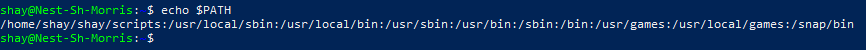
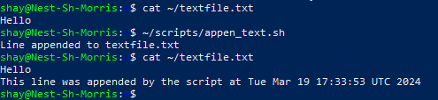
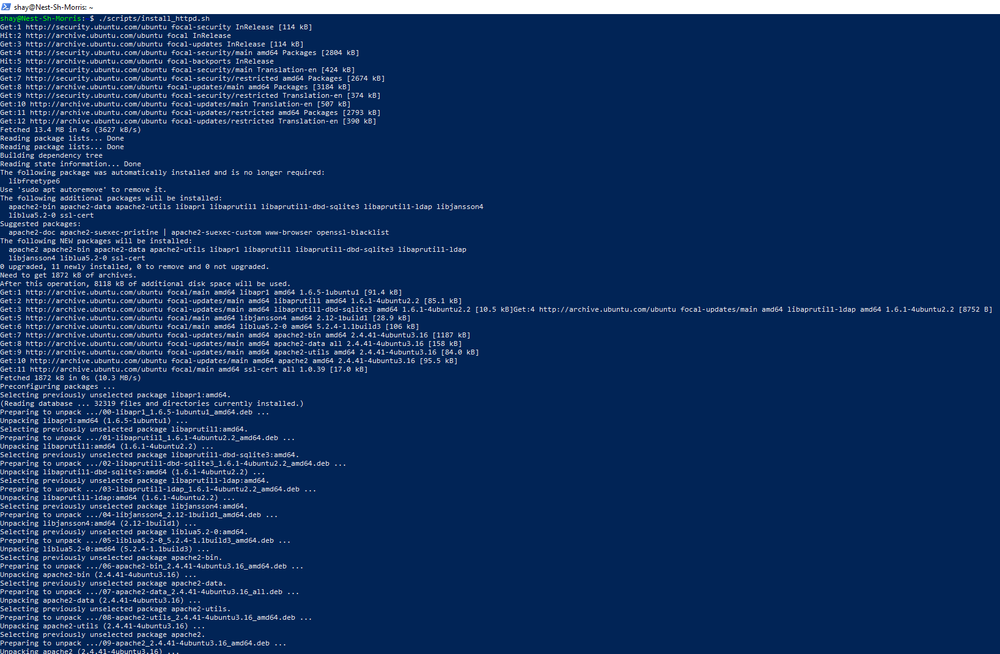
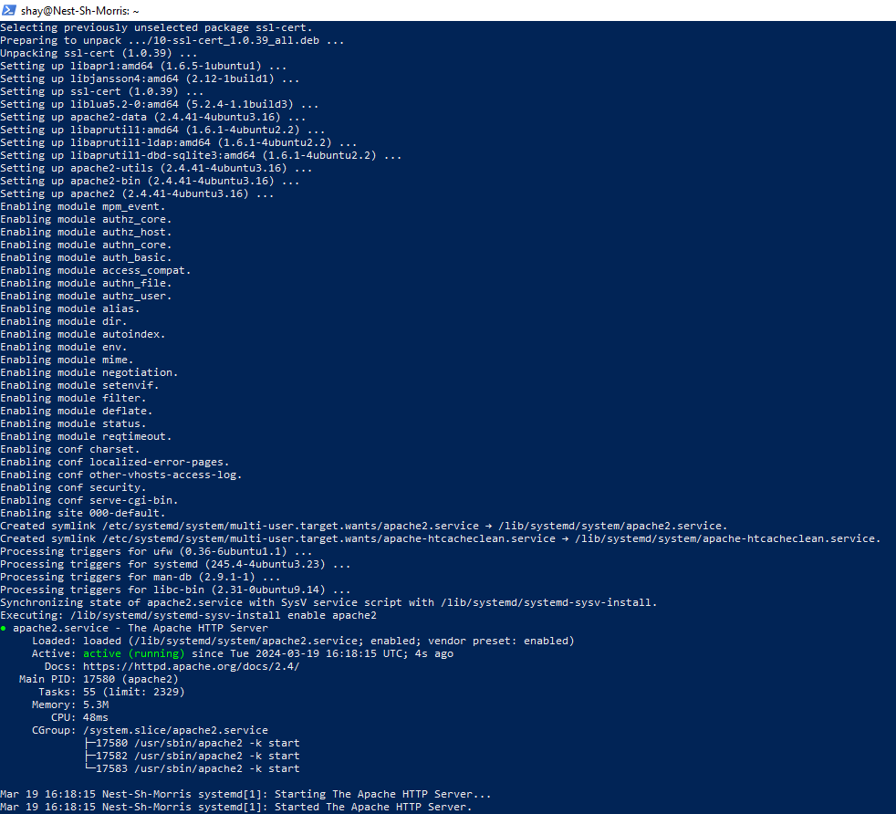
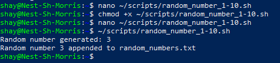
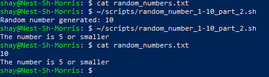

# [Bash Scripts]
A Bash shell is the default command line interface. you make a Bash script by writing a series of commands in a text file. Multiple commands can be executed by running such a script.

By using variables, conditions, and loops, among others, you can apply additional logic.

A user needs to have permissions to execute (x) the file in order the execute the script.

A script can only be found by Linux if you specify the path name, of by adding the path to the directory where the script lives to the PATH variable

Using .sh as file extension helps us humans to understand what the file is. Linux itself has no need for this, as there are no file extentions in Linux.

## Key-terms
Bash shell: the default command line interface in Linux. 

Bash script: a series of commands written in a textfile.

.sh: extension used to let humans understand that it's a bash script file. Not needed for Linux itself.

$: Used to show that the Bash shell is awaiting a command from the user. Such a command is called a shell prompt. 

#: Used to show that the shell is running in root, and is awaiting a superuser shell prompt.

## Assignment
### Used sources
[Source 1: Adding a directory to $PATH](https://linuxize.com/post/how-to-add-directory-to-path-in-linux/)

[Source 2: Creating the scripts: ChatGPT](https://chat.openai.com/)

### Experienced problems
My scripting knowledge is not where it needs to be to write them myself, so I used ChatGPT for this. 

### Result
Exercise 1:

Tasks:

-	Create a directory called ‘scripts’. Place all the scripts you make in this directory.    

            mkdir scripts
-	Add the scripts directory to the PATH variable.  
    -   Use syntax `export PATH=”[directory location]:$PATH”`. In my case: `export PATH=”$HOME/shay/scripts:$PATH”`. Add this command at the end of the ~/.bashrc file to make it permanent. When using the command in the Bash shell, it is temporary. 
    -   Adding the command to the `~/,bashrc` file can be done by opening it with nano e.g. `$ nano ~/.bashrc`  
    -   Either restart the connection to the server, or load the new $PATH into the current shell session with the following command: source `~/.bashrc`
    -   Confirm the load was successful with the command: `$ echo $PATH`
-	Create a script that appends a line of text to a text file whenever it is executed.
Create a script that installs the httpd package, activates httpd, and enables httpd. Finally, your   
    -   Creating script: `touch /home/shay/scripts/append_text.sh`
    -   The script:  
        ```
        #!/bin/bash

        # Define the text to append
        line_to_append="This line was appended by the script at $(date)"

        # Specify the file to append to
        file_to_append="textfile.txt"

        # Append the line to the file
        echo "$line_to_append" >> "$file_to_append"

        # Display a message
        echo "Line appended to $file_to_append"
        ```

    -	Script should print the status of httpd in the terminal.
-  	Create a script that installs the httpd package, activates httpd, and enables httpd. Finally, your script should print the status of httpd in the terminal.
    -   ```
        #!/bin/bash

        # Install the httpd package
        sudo apt-get update sudo apt-get install -y apache2  # Start and enable httpd sudo systemctl start apache2 sudo systemctl enable apache2

        # Print the status of httpd
        sudo systemctl status apache2
        ```

Exercise 2:

Tasks:  
*   Create a script that generates a random number between 1 and 10, stores it in a variable, and then appends the number to a text file.  
    -   ```
        #!/bin/bash

        # Generate a random number between 1 and 10
        random_number=$(( (RANDOM % 10) + 1 ))

        # Print the random number to the terminal
        echo "Random number generated: $random_number"

        # Append the random number to a text file
        echo $random_number >> random_numbers.txt

        echo "Random number $random_number appended to random_numbers.txt"
        ```
Exercise 3:

Tasks:
*	Create a script that generates a random number between 1 and 10, stores it in a variable, and then appends the number to a text file only if the number is bigger than 5. If the number is 5 or smaller, it should append a line of text saying "the number is 5 or smaller" to that text file instead.
    -   ```
        #!/bin/bash

        # Generate a random number between 1 and 10
        random_number=$(( (RANDOM % 10) + 1 ))

        # Check if the random number is greater than 5
        if [ $random_number -gt 5 ]; then
            # Append the random number to the text file
            echo "Random number generated: $random_number"
            echo $random_number >> random_numbers.txt
        else
            # Append a message to the text file
            echo "The number is 5 or smaller"
            echo "The number is 5 or smaller" >> random_numbers.txt
        fi
        ```  
          
Printscreens:  

  
  
  
  






