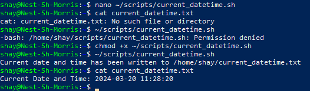
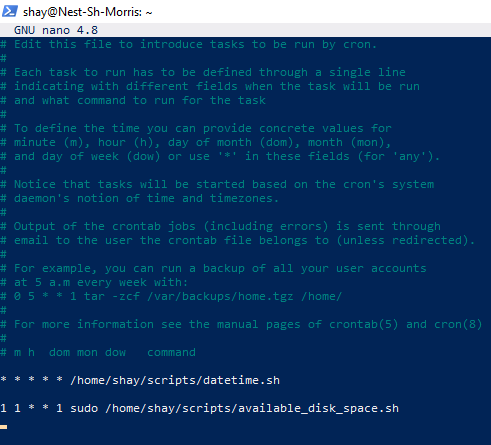
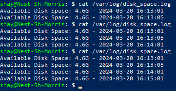

# [Cron Jobs]
With Cron jobs processes can be executed on a regular schedule. Things like writing the available disk space to a log file every hour, or checking for system updates every 2nd day of the month.

## Key-terms
Cron Job: A process that is executed on a regular basis.

User crontab file: A file that holds jobs that will run only for the specific user.

System crontab file: A file that holds jobs that will run for all users.

## Assignment
### Used sources
[Source 1: For creating the scripts I used ChatGPT](https://chat.openai.com/)

### Experienced problems
I forgot to add execute permissions quite a few times during the process. This isn't a second nature procedure for me yet. 

Also, I got the datetime.sh working in crontab. Since I was mucking about in user crontab and system crontab, I wanted to be sure about what one was giving me the wanted results. I deleted the cronjobs and tried again. Neither one was working anymore. After way too long I realised I was missing a forward slash at the start of my script path. I never got system crontab working. 

### Result
Tasks:

-	Create a Bash script that writes the current date and time to a file in your home directory.
    -   ```
        #!/bin/bash

        # Define the file path
        file_path="$HOME/datetime.txt"

        # Get the current date and time
        current_datetime=$(date "+%Y-%m-%d %H:%M:%S")

        # Write the current date and time to the file
        echo "Current Date and Time: $current_datetime" > "$file_path"
        ```
-   Register the script in your crontab so that it runs every minute.
    -   I’m choosing the user crontab to register the script. This is done with the following command: `$ crontab -e`. (See second image)
-   Create a script that writes available disk space to a log file in ‘/var/logs’. Use a cron job so that it runs weekly.
    -   ```
        #!/bin/bash

        # Define the log file path
        log_file="/var/log/disk_space.log"

        # Get the available disk space
        disk_space=$(df -h / | awk 'NR==2{print $4}')

        # Get the current date and time
        current_datetime=$(date "+%Y-%m-%d %H:%M:%S")

        # Write the available disk space and current date/time to the log file
        echo "Available Disk Space: $disk_space - $current_datetime" >> "$log_file"

        echo "Available disk space has been written to $log_file"
        ```

Images:

  
  
  
  

