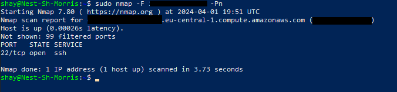

# [Network Detection]
Analysing your network is key when preventing or stopping an attack on it. Nmap and Wireshark are two of the many tools available to do this. 
Nmap (Network Mapper) finds information about a network by scanning it. Wireshark is a protocol analyser. By looking at network traffic it is able to show information about packets, like protocols and destination. 

## Key-terms
Nmap (Network Mapper): A tool that is used to scan a network.

Wireshark: A tool used to analyse data packets on network traffic.

Data packet: A small segment of a larger message.

## Assignment
### Used sources
Source 1: Classmate helped me along with the exercise.

[Source 2: What is a packet?](https://www.cloudflare.com/learning/network-layer/what-is-a-packet/)

### Experienced problems

### Result

Tasks:

-	Scan the network of your Linux machine using nmap. What do you find?
    -   I can see that the host is up, as well as its latency. I can see tcp is open on port 22 through ssh. See image below. IP address is removed as a practice in good security.
-	Open Wireshark in Windows/MacOS Machine. Analyse what happens when you open an internet browser. (Tip: you will find that Zoom is constantly sending packets over the network. You can either turn off Zoom for a minute, or look for the packets sent by the browser between the packets sent by Zoom.)
    -	A new packet pops up in Wireshark. In this, a lot of information can be found. A lot I don’t understand, but you can see information on things like the IP (Internet Protocol), TCP (Transmission Control Protocol), and HTTP (Hypertext Transfer Protocol). As a way of learning proper security measures from the start, I won’t include a screenshot.

Image:

