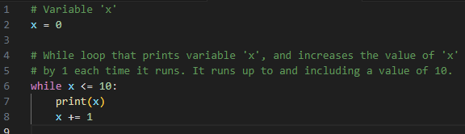
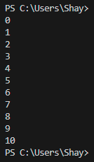
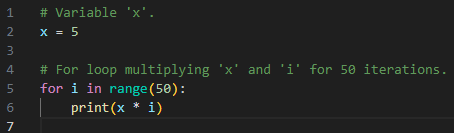
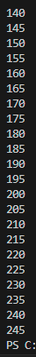
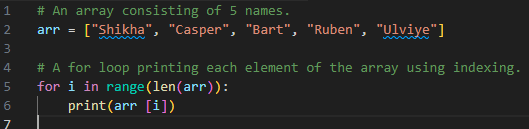
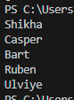

# [Loops]
Loops can be used when you want to run a block of code more than once. For example, wanting to do an operation on every item on a (large) list, or wanting to write an algorithm that goes along the same set of instructions for multiple iterations. 
Python has two types of loops: the _while_ loop, and the _for_ loop. The _while_ loop runs while a condition is true. They can run forever, as long as the condition doesn't change. To get out of an infinity loop, you press ctrl-c (or command-c on MacOS) to force quit the running code. The _for_ loop runs for a predetermined number of iterations. You can hard code this number using the _range()_ function. You can also dynamically assign a number with this function, by using a variable, size of a list, or the number of lines in a document. With _for_ loops it is also possible to accidentally create an infinity loop. Use the same command (ctrl/cmd+c) to exit your program.


## Key-terms
While loop: A while loop runs a block of code for as long as the condition is true.

For loop: A for loop runs a block of code for a predetermined number of iterations.

Infinity loop: An infinity loop is when a while loop, or for loop, gets stuck in a neverending cycle of running a block of code.

Range() function: A range() function is used to run a _for_ loop a specific number of times. The syntax is: ```range(start,end,step)```, with an example: ```range(0,40,2). start denotes the start of the range (defaults to 0 when not assigned), end denotes the end of the range (must always be assigned), and step denotes the amount of numbers it increases (or decreases with negative numbers) each step (defaults to 1 when not assigned). 

## Assignment
### Used sources
[Source 1: Why does i in for loop start at 0?(and other useful for loop things)](https://www.digitalocean.com/community/tutorials/python-for-loop-example)

[Source 2: How to print part of a tuple using indexing](https://www.tutorialspoint.com/python-program-to-print-elements-of-a-tuple)

### Experienced problems


### Result
Tasks:  

Exercise 1:
-	Create a new script.   
&check; 
-	Create a variable x and give it the value 0.  
&check;
-	Use a while loop to print the value of x in every iteration of the loop. After printing, the value of x should increase by 1. The loop should run as long as x is smaller than or equal to 10.  
    
  
Exercise 2:
-	Create a new script.  
&check;
-	Copy the code below into your script.  
        ```for i in range(10):```  
        ```# do something here```

-	Print the value of i in the for loop. You did not manually assign a value to i. Figure out how its value is determined. 
    -	This is because a range() function is used, and when only one number is assigned to a range function, it is the end statement. The other statements (start, and step) are defaulted. For start this is 0.  
-	Add a variable x with value 5 at the top of your script.  
&check;
-	Using the for loop, print the value of x multiplied by the value of i, for up to 50 iterations.    
      
Note: I didn't include the full results, since the code shows there is no start defined. This implies the result starts at 0, and from there it can be concluded that the final multiplication should result in 245.
  
Exercise 3:
-	Create a new script.  
&check;
-	Copy the array below into your script.
arr = ["Shikha", "Casper", "Bart", "Ruben", "Ulviye"]  
&check;
-	Use a for loop to loop over the array. Print every name individually.  
    

