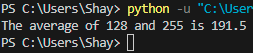

# [Functions]
A few functions have already been treated in previous assignments, like _print()_, and _input()_. A function is a block of code that runs only when it is called. You can recognise a function by its brackets "_()_" next to the function name. These brackets serve as a place for data input into the function. Functions then return data as a result.  
There are built-in functions, but you can also write your own custom functions, or import them from a library or package. 

## Key-terms
Function: A function is a block of code that runs only when it is called.

Brackets: Brackets are used to input data into a function. They are placed right after the function's name e.g., _print()_. Print is the function's name, and it is followed directly by brackets.

## Assignment
### Used sources
[Source 1: How to import the random function](https://stackoverflow.com/questions/14985798/python-random-function#:~:text=import%20random%20imports%20the%20random,random()%20.)

[Source 2: How to create your own function](https://towardsdatascience.com/how-to-create-user-defined-functions-in-python-e5a529386534)

[Source 3: Chat GPT for some added advice on functions](chat.openai.com)

### Experienced problems
When I created my own function, it was returning "None" as an answer. I looked up why, and good ol' Chat GPT told me I needed to add "return" before the code snippet that divides the two parameters. 

### Result
Tasks:
Exercise 1:
-	Create a new script.  
    &check;
-	Import the random package.  
    &check;
-	Print 5 random integers with a value between 0 and 100.
            
    
Exercise 2:
-	Create a new script.  
    &check;
-	Write a custom function myfunction() that prints “Hello, world!” to the terminal. Call myfunction.  
        
-	Rewrite your function so that it takes a string as an argument. Then, it should print “Hello, NAME!”.  
        

 Exercise 3:
-	Create a new script.  
    &check;

    -   Copy the code below into your script.  
```
        def avg():
        # write your code here
        # you are not allowed to edit any code below here

        x = 128
        y = 255
        z = avg(x,y)

        print("The average of",x,"and",y,"is",z)
```  
&check;
-	Write the custom function avg() so that it returns the average of the given parameters. You are not allowed to edit any code below the second comment.  
        