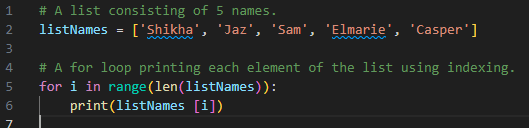
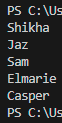
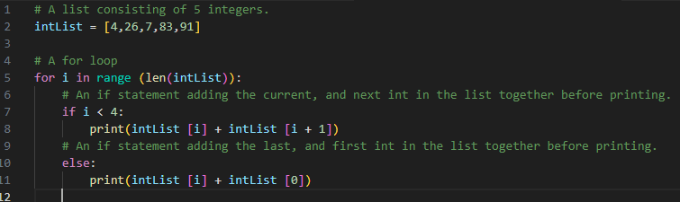
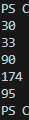

# [Lists]
A list of values can be declared in a single variable. Such a list is represented by square brackets '[]', and each value in it separated by a comma.  
An index of numbers is used to indicate each position in a list. Indexes start at 0, so the first item in a list will actually be item no. 0. The next, no. 1, and so forth. Each individual item in a list can be called by calling its index.  
  
For loops can be used to loop over a list. Instead of a number within a range, _i_ (or any other name you give the declared variable) will have the value of an item in the list. You can still use range() to loop over a list. 

## Key-terms
List: a variable consisting of multiple values that are stored using an index. This index always starts at 0. The index can later be used to call upon individual values within the list.

Square brackets:

## Assignment
### Used sources

### Experienced problems

### Result
Exercise 1:
-	Create a new script.  
    &check;
-	Create a variable that contains a list of five names.  
    &check;
-	Loop over the list using a for loop. Print every individual name in the list on a new line.  
          

 Exercise 2:
-	Create a new script.  
    &check;
-	Create a list of five integers.  
    &check;
-	Use a for loop to do the following for every item in the list:
    -	Print the value of that item added to the value of the next item in the list.
    -	If it is the last item, add it to the value of the first item instead (since there is no next item).  
        

