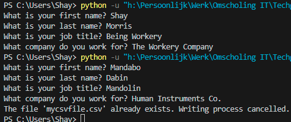

# [Key-Value Pairs]
Key-value pairs are a general concept you will definitely encounter. For instance in NoSQL databases, or AWS/Azure resource tags. Dictionaries (dict) in Python also use key-value pairs to store information. Dicts in Python are written using curly brackets {}. Call a dict's key to get its values.

## Key-terms
Key-value pairs: A key/value pair is a data type. This data type includes two pieces of data that have a set of associated values and a group of key identifiers.

NoSQL database: &emsp; A NoSQL database is an approach to database design. This design enables the storage and querying of data outside the traditional structures found in relational databases.

AWS/Azure resource tags: Resource tags are metadata elements that you apply to AWS/Azure resources.

Dicts (dictionaries): Dictionaries are collections of data values which are stored in key-value pairs.

Curly brackets: Curly brackets are used in Python to define a dictionary.

## Assignment
### Used sources
[Source 1: What is a key-value pair?](https://www.indeed.com/career-advice/career-development/key-value-pair#:~:text=A%20key%2Dvalue%20pair%20is%20a%20data%20type%20that%20includes,belonging%20to%20the%20data%20set.)

[Source 2: What is a NoSQL database?](https://www.ibm.com/topics/nosql-databases)

[Source 3: What are AWS/Azure resource tags?](https://learn.microsoft.com/en-us/azure/azure-resource-manager/management/tag-resources)

[Source 4: What are dictionaries?](https://www.w3schools.com/python/python_dictionaries.asp#:~:text=%7D-,Dictionary,and%20earlier%2C%20dictionaries%20are%20unordered.)

[Source 5: How to loop through dict key-value pairs](https://www.w3schools.com/python/gloss_python_loop_dictionary_items.asp)

[Source 6: How to add user input to dict](https://www.geeksforgeeks.org/how-to-add-user-input-to-a-dictionary-in-python/)

[Source 7: How to write dict to csv file](https://stackoverflow.com/questions/10373247/how-do-i-write-a-python-dictionary-to-a-csv-file)

[Source 8: How to keep csv file from being overwritten (used Chat GPT)](https://chat.openai.com)

### Experienced problems
I was having problems trying to get the csv file to contain the information I was writing to it. This was solved the next day. How exactly I do not know. It just worked. Then I was having trouble keeping the file from being overwritten. My whole code didn't seem to execute print functions anymore. After a lot of fumbling about, I realised it was a simple case of not having the new code selected. Although I don't fully understand when code stops being selected. Maybe I hadn't updated/saved the code before running it. That's the most likely reason I can think of. Yes, that was the case. 

### Result
Tasks:

Exercise 1:
-	Create a new script.  
    &check;
-	Create a dictionary with the following keys and values:  

    | Key        | Value          |
    | ---------- | -------------- |
    | First name | Casper         |
    | Last name  | Velzen         |
    | Job title  | Learning coach |
    | Company    | Techgrounds    |

-	Loop over the dictionary and print every key-value pair in the terminal.  
        

Exercise 2:
-	Create a new script.  
    &check;
-	Use user input to ask for their information (first name, last name, job title, company). Store the information in a dictionary.  
    &check;
-	Write the information to a csv file (comma-separated values). The data should not be overwritten when you run the script multiple times.  
        

