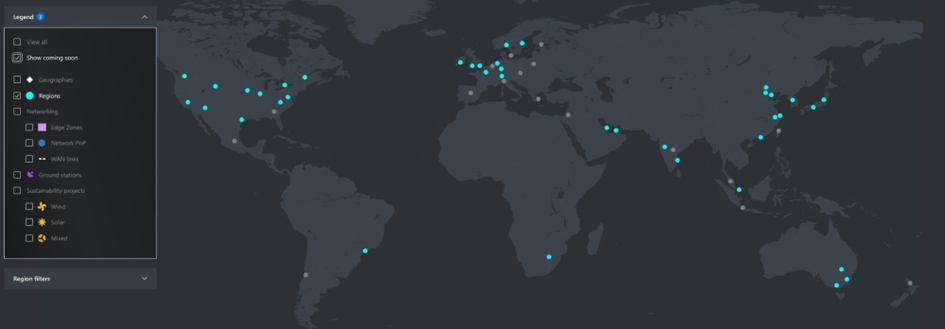
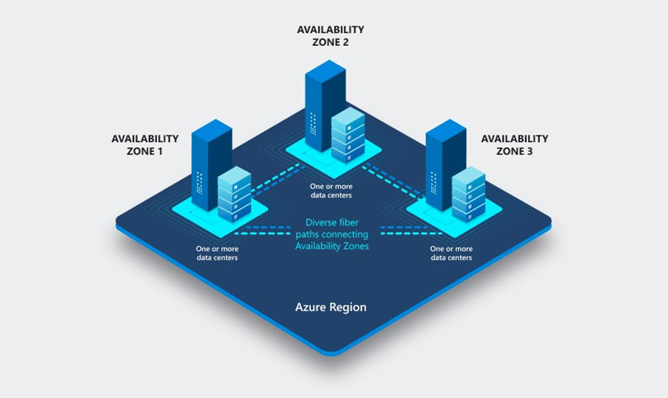
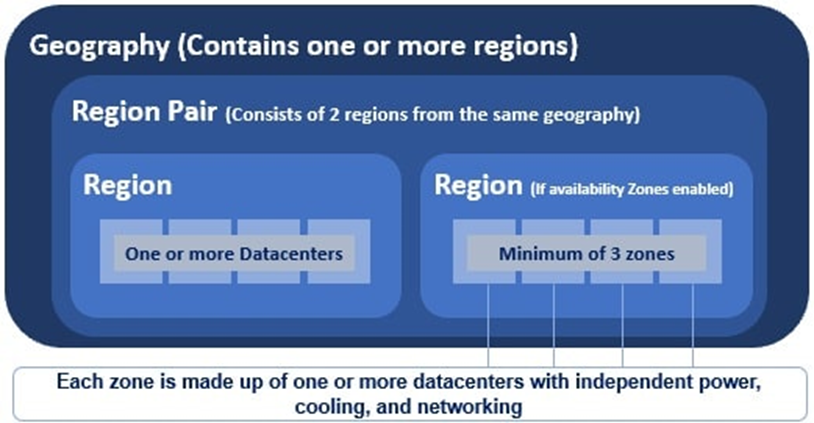

# [Azure Global Infrastructure]
From servers to networking, everything is virtualised in the cloud. When you're a customer, you don't need to worry about the underlying physical infrastructure. The physical location of your data or application, however, can be important. The global infrastructure of Azure consists of the following components:

- Regions
- Availability Zones
- Region Pairs

You control which region you use, although not every service is available in every region. Azure Subscriptions for instance. With other services like Azure Virtual Machines on the other hand, specific data centers can be chosen. 

## Key-terms
[Schrijf hier een lijst met belangrijke termen met eventueel een korte uitleg.]

## Assignment
### Used sources
[Source 1: What is an Azure Region, and an Azure Availability Zone?](https://www.mongodb.com/cloud-providers/azure-regions#:~:text=An%20Azure%20region%20is%20a,other%20cloud%20providers%20to%20date.)

[Source 2: What is an Azure Region Pair?](https://learn.microsoft.com/en-us/azure/cloud-adoption-framework/ready/azure-setup-guide/regions)

[Source 3: Why choose one region over the other?](https://learn.microsoft.com/en-us/azure/cloud-adoption-framework/ready/azure-setup-guide/regions)

### Experienced problems
[Geef een korte beschrijving van de problemen waar je tegenaan bent gelopen met je gevonden oplossing.]

### Result
Study:
-	What is an Azure Region?
    -	An Azure Region is a geographical area where one or more physical Azure data centers are situated. 
    
-	What is an Azure Availability Zone?
    -	An Azure Availability Zone is a physical data center location within a region.
    
-  	What is an Azure Region Pair?
    -	An Azure Region Pair is where two regions, usually located in the same geopolitical area, are paired with each other. This provides resiliency during catastrophic region failures. Region pairing is mostly used for GRS (Geo-Redundant Storage), and other Azure services that depend on Azure Storage for replication. 
Newer regions aren’t paired. They use availability zones for high availability and resiliency.
    
-	Why would you choose one region over the other?
    -	Data sovereignty and data privacy regulations by government organisations around the world make that in some situations, you’ll need to store data in the same region as the users. 
    -   It can be a good idea to have your region the same as your userbase, this as to reduce latency, and thereby optimising network connectivity.

