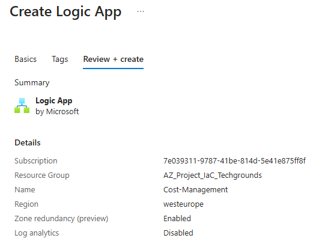
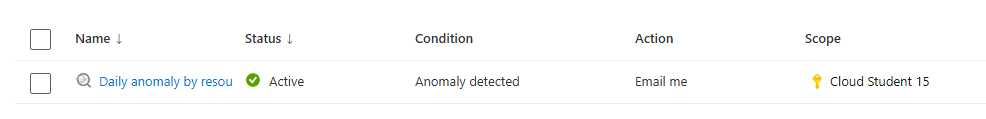

# [Azure Cost Management]
An often referred advantage of the cloud is that you only pay for what you use. This is called OPEX, instead of CAPEX expenses. The "Cost Management + Billing" tool gives insight in your expenses in Azure, and lets you manage your subscriptions.  
With a 'Free Account' or 'Student Account' you get some money from Microsoft to experiment with Azure. What happens though, is that after 30 days all of your subscriptions automatically get stopped. This means that any services still running will be turned off.

With a 'Pay-as-you-go' subscription, there are a few services that to a certain extent will always be free. Understand that these services can be integrated with other services for which you do have to pay.

The following principles are offered by Azure to successfully reduce your costs:

- Planning
- Visibility
- Accountability
- Optimisation
- Iteration

The TCO (Total Cost of Ownership) is used to calculate what an infrastructure costs when it is hosted in the traditional manner. With the TCO-calculator you can compare the costs of a traditional infrastructure with the costs of the same infrastructure on Azure.

## Key-terms
[Schrijf hier een lijst met belangrijke termen met eventueel een korte uitleg.]

## Assignment
### Used sources
[Source 1: Azure documentation](https://learn.microsoft.com/en-us/azure/?product=popular)

[Source 2: Principles for cost management](https://learn.microsoft.com/en-us/azure/cost-management-billing/)

[Source 3: Azure free subscription conditions](https://azure.microsoft.com/en-gb/free/search/?ef_id=_k_CjwKCAjwuJ2xBhA3EiwAMVjkVFGs68_wWutbiepTwc9yqWJhKh-3S4TYxUYt6ur4X3N9aiaiLkoo6hoC5QIQAvD_BwE_k_&OCID=AIDcmmiouhop3i_SEM__k_CjwKCAjwuJ2xBhA3EiwAMVjkVFGs68_wWutbiepTwc9yqWJhKh-3S4TYxUYt6ur4X3N9aiaiLkoo6hoC5QIQAvD_BwE_k_&gad_source=1&gclid=CjwKCAjwuJ2xBhA3EiwAMVjkVFGs68_wWutbiepTwc9yqWJhKh-3S4TYxUYt6ur4X3N9aiaiLkoo6hoC5QIQAvD_BwE)

[Source 4: Difference OpEx and CapEx](https://www.investopedia.com/ask/answers/112814/whats-difference-between-capital-expenditures-capex-and-operational-expenditures-opex.asp#:~:text=Capital%20expenditures%20are%20a%20company's,%2C%20utilities%2C%20and%20property%20taxes.)

[Source 5: Azure TCO(Total Cost of Ownership) calculator](https://azure.microsoft.com/en-us/pricing/tco/calculator/)

[Source 6: What is Azure's TCO-calculator?](https://www.linkedin.com/pulse/maximizing-roi-azure-total-cost-ownership-tco-calculator-singh-tanxc#:~:text=The%20Azure%20Total%20Cost%20of%20Ownership%20(TCO)%20Calculator%20is%20a,and%20applications%20to%20the%20cloud.)

### Experienced problems
When looking up how to create an alert to manage costs, I came across a microsoft source that told me to make a logic app. The instructions seemed out of date, and I couldn't complete them. Afterwards I got Chat GPT to help, and it told me to do something completely different. I've got both images included in the tasks.

### Result
**Tasks:**

**Study:**
-	**The Azure principles for cost management.**
    -	There are six principles for cost management:
        1.	Pricing + estimation
        2.	Reporting + analytics
        3.	Monitoring
        4.	Optimisation
        5.	Cost allocation
        6.	Automation + extensibility 
-	**The conditions of the ‘Free subscription.’**
    -	There are three conditions: 
        1.	The first 30 days are free, with $200 credit to use in those 30 days. There’s also free amounts of popular services and 55+ other services.
        2.	After the credit, move to pay as you to go to keep getting popular services and 55+ other services. Only pay if you use more than the free monthly amounts.
        3.	After 12 months, continue to get 55+ services free – and still only pay for what you use beyond the free monthly amounts.
-	**The difference between CapEx and OpEx.**
    -	CapEx stands for capital expenditures. This means any major purchases a company makes that will be used over a long term.
    -	OpEx stands for Operating Expenses. This means any day-to-day expenses that a company incurs to keep its business running. 

-	**The TCO-calculator.**
    -	The Total Cost of Ownership (TCO) Calculator is a powerful tool used to define your workloads. It provides a comprehensive analysis of both direct and indirect costs associated with running workloads in the Azure cloud environment. This way a business or organisation can check the cost of the cloud, or compare it to their on-premise infrastructure and applications.
 Opdracht:
-	**Make an alert with which you can manage your costs.**   
    Wrong, creating a logic app:
       
    Correct, creating an alert though the cost management settings:
-	**Understand the options that Azure offers to look into your expenses.**
    1.	Cost Management + Billing in Azure Portal: The Azure portal provides a centralized location where you can view and analyze your Azure spending. It offers features such as cost analysis, budgeting, and cost alerts. You can access it by navigating to the "Cost Management + Billing" section in the Azure portal.
    2.	Azure Cost Management: This is a dedicated service within Azure that provides comprehensive cost management capabilities. It allows you to track and optimize your Azure spending across various dimensions, including resource groups, subscriptions, and services. Azure Cost Management offers features such as cost analysis, budgeting, recommendations, and cost alerts.
    3.	Azure Cost Management APIs: Azure provides APIs that allow you to programmatically access and manage your cost and usage data. You can use these APIs to integrate cost management functionality into your own applications and workflows.
    4.	Cost Analysis: Azure Cost Management provides a cost analysis tool that allows you to visualize and analyze your spending patterns. You can view costs by resource, service, region, time period, and other dimensions. Cost analysis helps you identify cost drivers, optimize spending, and track the impact of cost-saving initiatives.
    5.	Budgets: Azure allows you to set budgets to track and control your spending. You can set budget thresholds based on cost or usage, and receive alerts when spending exceeds these thresholds. Budgets help you stay within your financial targets and avoid unexpected charges.
    6.	Recommendations: Azure Cost Management provides cost optimization recommendations to help you reduce your Azure spending. These recommendations are based on best practices and analysis of your usage patterns. They cover areas such as rightsizing, reservation purchases, and resource optimization.
    7.	Cost Allocation: Azure allows you to allocate costs to different departments, projects, or cost centers within your organization. You can use tags and resource groups to categorize your spending, and then allocate costs based on these categories. Cost allocation helps you track spending accountability and chargeback.
    8.	Integration with Azure DevOps: If you're using Azure DevOps for managing your development projects, you can integrate it with Azure Cost Management to track the costs associated with your DevOps activities. This integration provides visibility into the cost of your development and deployment pipelines.

