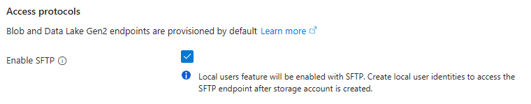
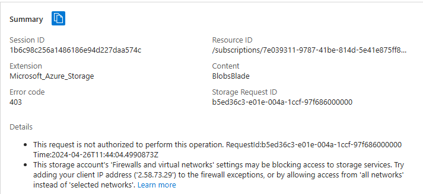

# [Azure Storage Account]
To save data in Azure you need an Azure Storage Account. In a Storage Account, all Azure Storage data objects like blobs, files, disks, and tables can be found. Data in a Storage Account is secure, highly available, durable, and massively scalable. ALl data in a Storage Account is reachable through the internet with HTTP and HTTPS. Because it's so easy to reach, you have to pay very good attention that only the right identities have permission to get to your data. Azure Storage explorer is a free GUI to manage your data in Azure. A lot of IaaS and PaaS services Azure has, make use of Azure Storage Accounts. Other than storing data, Blob Storage can also be used to host static websites.  

## Key-terms

## Assignment
### Used sources
[Source 1: How to add data blocks in Azure](https://learn.microsoft.com/en-us/azure/storage/blobs/storage-quickstart-blobs-portal)

[Source 2: Chat GPT helped throughout the whole process](https://chat.openai.com)

[Source 3: Installing Azure Storage Explorer](https://learn.microsoft.com/en-us/azure/storage/storage-explorer/vs-azure-tools-storage-manage-with-storage-explorer?tabs=windows#download-and-install)

### Experienced problems
I'm finding it quite overwhelming to have so many new options to wade through trying to find my answer. Seeing as the first task leaves it wide open as to where I can find any option to make sure only I have access to the data, it set me up for a bit of a goose chase. In the end it appeared to be quite self-explanatory, after deciding to look for the option after creating the account. I guess it's another lesson in playing around a bit, and not letting caution take over. Caution is good, don't get me wrong, but when an answer doesn't present itself after looking over things a few times, it's time to go look further instead of hesitating. Such hesitation should be reserved for higher stakes. 

Also, because of the overload of information, I was constantly overlooking the firewalls and virtual networks setting header.

I'm finding myself using Chat GPT more than usual. With Azure being such a huge thing, I find Chat GPT makes it easier for me to stay on track by asking pointed questions. 

### Result
**Tasks:**  

**Exercise 1:**
-   **Make an Azure Storage Account. Make sure that only you have access to the data.**
    -	I had a difficult time understanding the Microsoft source on making sure that only I have access to the data, so I asked Chat GPT. It didn’t tell me to enable SFTP, but it was the only thing I could find that resembled the option that I needed. Chat GPT told me that I could either enable security features during, or after creating the account, so I’ll leave it at this and look further after creating. Chat GPT also talked about firewall settings, but I can’t seem to find them in the account creation fase. This was what I enabled while creating the account:  
        
    -	I needed to do it after account creation, or so it seems:  
          
-   **Place data in a storage service of choice through the console e.g., a cute kitty picture in Blob storage.**  
    -   I thought disabling public network access would still allow me to get everywhere. I was mistaken. I had to add '2.58.73.29' to the allowed ip addresses. After that I could get into my created container so that I could create a blob. I got the following error message which prompted the realisation of my mistake:  
      
        Result after allowing myself into the container:
        
-   **Pick up the data to your own computer through the Azure Storage Explorer.**  
    

**Exercise 2:**  
-   **Make a new container.**  
    
-   **Upload the 4 files that together form the AWS Demo Website.** (note: this is an azure assignment, but we use AWS' Demo Website. It's a simple combination of HTML, CSS, and JavaScript and doesn't have any cloud specific functions)  
    
-   **Make sure that Static Website Hosting is turned on.**  
    
-   **Share the URL with a team member. Make sure your team member can see the website.**  
    -   The website wasn't showing for me. I got a 404 error. Chat GPT told me that I needed to set the Public Access Level to 'anonymous read access for blobs only' or 'anonymous read access for containers and blobs':  
       
    After doing so I still didn't get any results. I later found out the URL Chat GPT suggested wasn't working. While going through the website files I stumbled upon the option to copy the URL for certain files. After copying the one for the index file I was good to go:  
    
