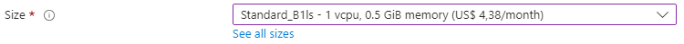
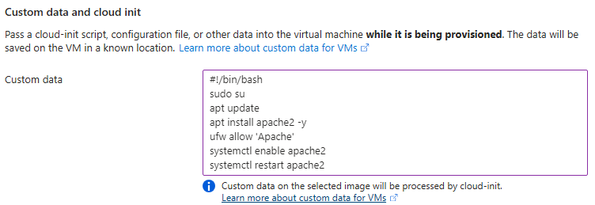
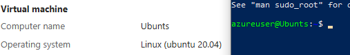
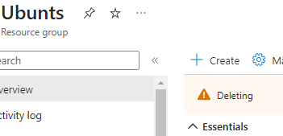

# [Virtual Machines]
Azure's Azure Virtual Machines is a service that allows you to make VM's. Anything you'd use a physical server for, you can also do with these VM's. Because these VM's are located in a Microsoft datacenter, you can only connect with them through the internet. We use an SSH (Secure Shell) protocol to connect with a remote Linux-machine. To connect with a Windows machine, we use the RDP (Remote Desktop Protocol). To make a VM you have to select an image. An image is a kind of blueprint for you machine. One of the things it consists of is a template for the OS. 

VM's exist is different sizes. Each size has differing vCPUs, RAM, Data disks, Max IOPA, temp storage, Premium disk support and price. 

For the OS disk (The root volume) you can choose between Premium SSD, Standard SSD, and Standard HDD. There's also the option to add extra Data disks.

There is the option to secure your VM with a NIC network security group. It is advised to configure network security groups on the subnet level (not on the instance level) where possible. Sometimes you need to have an allow/deny rule on a specific instance. Either way, the firewalls can be taken care of outside of the instance. This means you don't need to configure extra firewalls within the VM.

With Custom Data you can add a cloud-init script, config file, or other data that will run as you start your VM. This way you can configure servers automatically without having to log in. User Data is a new version of Custom Data. The biggest difference being that User Data stays available during the whole lifecycle of a VM.

Azure VM's price depends on the size, the image, the region it is situated, the amount of minutes it's turned on, and payment type. 

-   Pay-as-you-go is the most expensive option, but also the most flexible.
-   Reserved Instances are cheaper, but you're stuck to a reservation of 1 to 3 years.
-   Spot Instances are generally the cheapest, but it's availability depends on the demand on VM's at that moment. This means it's less dependable than the other options.

## Key-terms

## Assignment
### Used sources
[Source 1: How to get into when getting 'UNPROTECTED PRIVATE KEY FILE' warning.](https://stackoverflow.com/questions/25869207/getting-warning-unprotected-private-key-file-error-message-while-attempting)

### Experienced problems
I had forgotten what to do when I can't get access into my VM. A quick sifting through my old MD files reminded me I need to change security settings of the key file. I made me (as a user) the sole owner of the key file.

### Result
Tasks:
-	Log in bij je Azure Console.
    -	Maak een VM met de volgende vereisten:
    -	Ubuntu Server 20.04 LTS - Gen1  
        
    -	Size: Standard_B1ls  
        
    -	Allowed inbound ports:
        -	HTTP (80)
        -	SSH (22)  
        
    -	OS Disk type: Standard SSD  
        
    -	Networking: defaults  
        &check;
    -	Boot diagnostics zijn niet nodig  
        &check;
    -	Custom data:
        #!/bin/bash
        sudo su
        apt update
        apt install apache2 -y
        ufw allow 'Apache'
        systemctl enable apache2
        systemctl restart apache2  
        
-	Controleer of je server werkt.  
    
-	Let op! Vergeet na de opdracht niet alles weer weg te gooien. Je kan elk onderdeel individueel verwijderen, of je kan in 1 keer de resource group verwijderen.  
    
