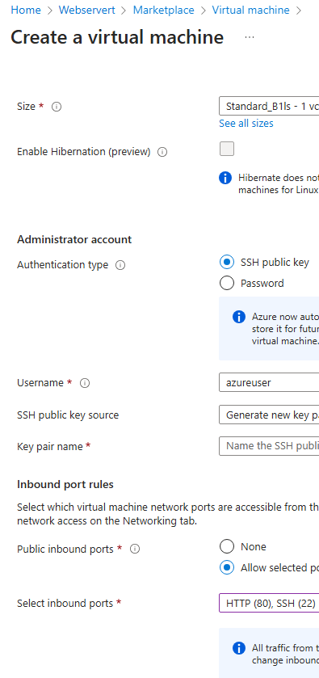
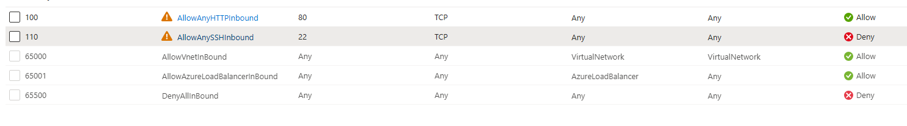
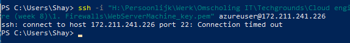
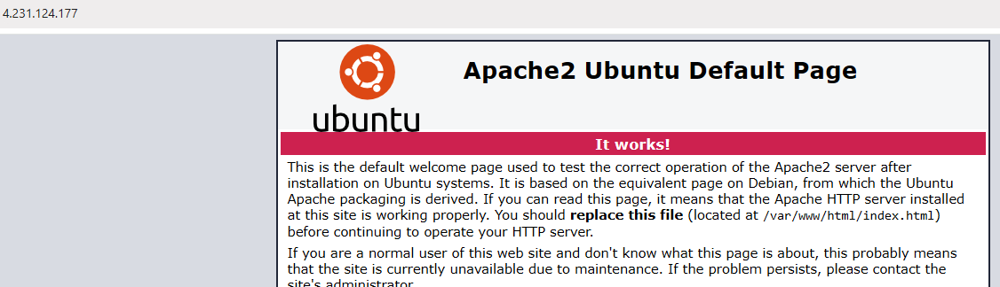

# [Firewalls]
Since all sources in the cloud are always online, it's important to secure these against harm, either accidental or purposeful. Azure Firewall can protect VNets against this kind of traffic.  
You can use your Firewall in different configurations in a subnet, or in a hub-and-spoke network. A Firewall always has a public IP address where all incoming traffic should be sent. It also needs a private IP Address where all outgoing traffic needs to go.  

As has been previously covered, there are two kinds of firewalls: stateless, and stateful. Azure Firewal is a stateful firewall.  

Because Azure Firewall is always highly monitoring traffic, it's a relatively expensive service. Because of that we're going to use the cheaper version in our exercise: Network Security Group (NSG).

## Key-terms

## Assignment
### Used sources
[Source 1: Difference between Basic and Premium Firewall](https://learn.microsoft.com/en-us/azure/firewall/choose-firewall-sku)

[Source 2: What are firewall policies?](https://cloud.google.com/firewall/docs/firewall-policies-overview#:~:text=Firewall%20policies%20let%20you%20group,Cloud%20(VPC)%20firewall%20rules.)

[Source 3: Why is Azure Firewall more than just a Firewall (Chat GPT)](chat.openai.com)

[Source 4: Difference Azure Firewall and NSG](https://www.opsramp.com/guides/azure-best-practices/azure-firewall-vs-nsg/#:~:text=Unlike%20Azure%20Firewall%2C%20which%20monitors,denies%20traffic%20to%20Azure%20resources.)

### Experienced problems
I was having difficulties connecting to my webserver through HTTP. Coach told me not to try it through PowerShell, but through the browser. This solved my problems.

### Result
**Study:**
-	**The difference between Basic and Premium Firewall.**
    -	There are three levels that you can choose from: Basic, Standard, and Premium. When choosing the right option, the first two options come down to the size of the company. Basic being advised for Small and Midsize Businesses (SMB), Standard being advised for customers looking for Layer 3-Layer 7 Firewall, that also need autoscaling to handle peak traffic periods of up to 30 Gbps. Finally we have Premium, and this option is advised to secure highly sensitive applications such as payment processing. 
-	**The difference between a Firewall and a Firewall Policy.**
    -	The difference between the two is that a Firewall is a network security device that monitors the traffic coming into and going out of your network. A Firewall Policy is a set of rules that can be implemented on a Firewall. This way you can set up specific policies for specific uses that you can then apply to your Firewall.
-	**How Azure Firewall is way more than only a Firewall.**
    -	On top of offering what a Firewall offers, Azure Firewall also offers the following:
        1.	Application Layer Filtering: Azure Firewall supports filtering at the application layer (Layer 7 of the OSI model), allowing you to control access based on specific applications or protocols. This enables more granular control over network traffic, allowing or denying access to specific applications or services.
        2.	Integrated Security Services: Azure Firewall integrates with other Azure security services such as Azure Security Center and Azure Sentinel, allowing you to leverage advanced threat detection, monitoring, and response capabilities to enhance your security posture.
        3.	Centralized Management: Azure Firewall provides centralized management and configuration through the Azure portal, PowerShell, or Azure CLI. This makes it easier to manage security policies and monitor network traffic across your entire Azure environment.
        4.	High Availability and Scalability: Azure Firewall is designed for high availability and scalability, ensuring that your network security remains resilient even during peak traffic or in the event of hardware failures. It automatically scales to handle increasing network traffic demands.
        5.	Application FQDN Filtering: Azure Firewall supports filtering based on fully qualified domain names (FQDNs), allowing you to control access to specific websites or services hosted on the internet. This is particularly useful for controlling access to SaaS applications or external services.
        6.	Built-in Threat Intelligence: Azure Firewall includes built-in threat intelligence capabilities that allow it to block known malicious IP addresses and domains, helping to protect your network from cyber threats without the need for manual configuration.
        7.	Traffic Inspection and Logging: Azure Firewall provides detailed logging and reporting capabilities, allowing you to monitor and analyze network traffic in real-time. This visibility helps you identify potential security threats and compliance issues.
	
-	**The difference between Azure Firewall and NSG.**
    -	As is noted right above, Azure Firewall offers a lot more than your plain old Firewall. NSG (Network Security Group) however, is your plain old Firewall. 

**Tasks:**
-	**Set up a webserver. Make sure that both SSH and HTTP are opened.**  
        
-	**Make an NSG in your VNET. Make sure that your webbrowser is still reachable through HTTP, but that SSH is blocked.**
    
-	**Test if your NSG works.**  
         
