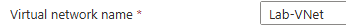
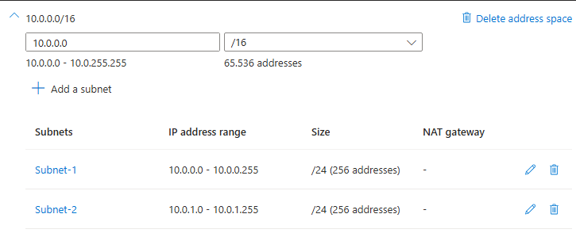
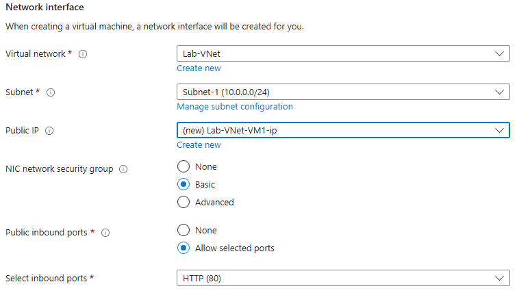
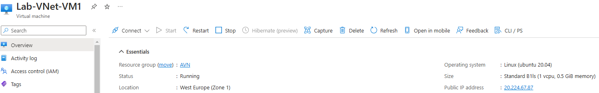
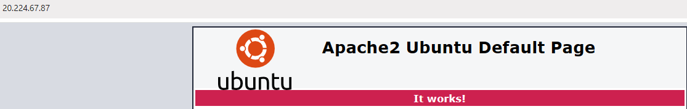

# [Azure Virtual Network]
With Azure Virtual Networks (VNets) you can let resources like VMs, web apps, and databases communicate with each other, with users on the internet, and with machines on-premises. VNets have the following responsibilities:

-   (Network-)isolation and -segmentation
-   Internetcommunication
-   Communication between Azure resources
-   Communication with on-premises resources
-   Routing of network traffic
-   Filtering of network traffic
-   Connecting to other VNets

When you make a new VNet, you decide a private IP range for your network. Within that range you can make your subnet. There are three ways to connect your network to an on-premises network:

-   Point-to-site VPNs:
    -   The Azure VNet gets approached with a VPN from a on-premises computer.
-   Site-to-site VPNs:
    -   The on-premises VPN device or gateway gets connected with the Azure VPN Gateway. This effectively creates one big local network.
-   Azure Expressroute:
    -   This is a physical connection from your local environment to Azure.

You can also connect two Azure VNets with each other through virtual network peering. This is made possible by user-defined Routing (UDR). Peering is possible with VNets in different regions.

An easy way to find out how traffic is being routed, is by looking in a NIC's "effective routes." There you can find the routes and the route tables that are associated with the routes.

## Key-terms

## Assignment
### Used sources

### Experienced problems
I was under the impression I needed to do something to make sure that subnet 1 would have no route to the internet. Little did I know that exactly nothing needs to be done for this. I added NSG's and routes before finding out how simple it actually was. See notes below.

### Result
Tasks:
Exercise 1:
-	Make a Virtual Network with the following requirements:
    -	First I create a resource group. In it, I create the virtual network.
        -	Region: West Europe
        -	Name: Lab-VNet  
        
        -	IP range: 10.0.0.0/16
    -	Requirements for subnet 1:
        -	Name: Subnet-1
        -	IP Range: 10.0.0.0/24
        -	This subnet cannot have a route to the internet
        -	To do this I created a NSG (Network Security Group) that denies any inbound and outbound traffic to the internet. I then connected this NSG to the first subnet.
        -	I stand corrected. I need to create a route table and assign it to the subnet. This route table has a destination “Internet” (0.0.0.0/0) and next hop type “Virtual appliance”, or “none”. 
        -	If “Virtual appliance” is chosen, an IP address of a virtual appliance within your VNet needs to be specified to act as a gateway.
        -	If “None” is chosen, the route effectively blocks any traffic destined for the internet. 
        -	I chose “None”
        -	This enables specific resources within the subnet to be allocated a public IP directly, which then connects it to the internet. 
        -	All of the above is crap. I was tricked, tricked! A subnet, per default, has no route to the internet. So nothing needs to be done to make sure this point is taken care of. 
    -	Requirements for subnet 2:
        -	Name: Subnet-2
        -	IP Range: 10.0.1.0/24  
        
 Exercise 2:
-	Make a VM with the following requirements:
-	An apache server has to have the following custom data installed:
    #!/bin/bash  
    sudo su  
    apt update  
    apt install apache2 -y  
    ufw allow 'Apache'  
    systemctl enable apache2  
    systemctl restart apache2
    -	There’s no SSH access necessary, there is for HTTP
    -	Subnet: Subnet-1
    -	Public IP: Enabled  
        
-	Check if your website is reachable  
            

