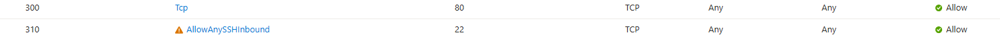
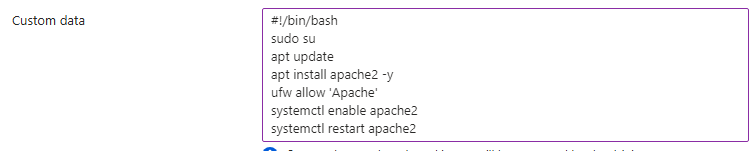
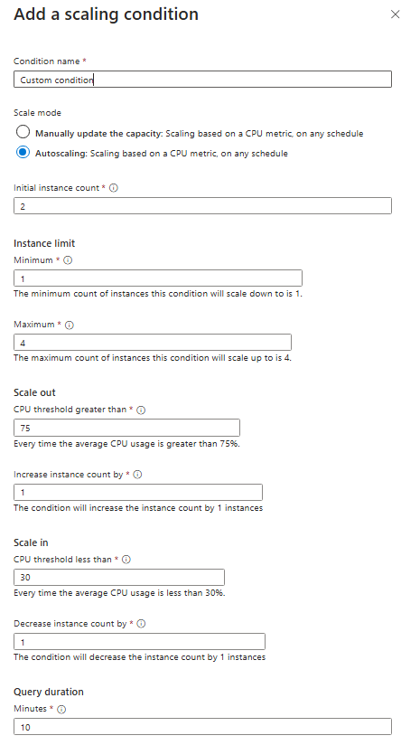
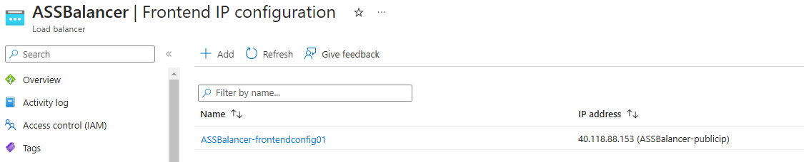
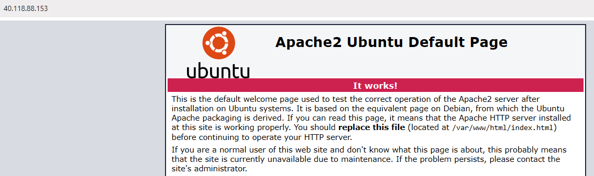
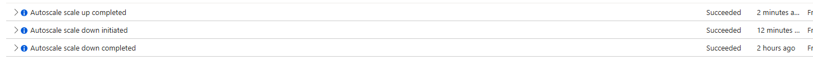

# [ALB & Auto Scaling]
One of the biggest advantages of the cloud is that you don't have to gamble how much capacity you need. You can always scale up and down with on-demand services. One of the services that makes that possible is called Autoscaling.  
When you run applications with a spiky workload, you can make a Scale Set VM instead of a single server. When the demand for your application is high, Autoscaling can automatically add VMs to your Scale Set. When the demand goes down, it can delete instances.  

To be sure that all VMs are the same, you have to appoint an image while configuring a VM Scale Set. You can later adjust this image with the reimage option. Auto Scaling makes use of Azure Monitor to determine if VMs need to be added or deleted.  

In a traditional architecture a client connects with a single server with a single public IP-address. When you have a fleet of servers, this doesn't work anymore. That's why you can use a load balancer as endpoint for the client. The load balancer will forward the request to one of the servers in your fleet and send the answer back to the client.  

Azure has two managed solutions for load balancing to a fleet of servers:  

-   Azure Load Balancer: You get this free with a VM Scale Set. The ALB works on layer 4 of the OSI stack (TCP/UDP). An ALB can only route to Azure resources.
-   Application Gateway: This load balancer works on layer 7 of the OSI stack (HTTP/Https). It also has support for, among others, SSL termination and Web Application Firewall (WAF) features. An Application Gateway can route to any routable IP address.

## Key-terms


## Assignment
### Used sources
[Source 1: Chat GPT](https://chat.openai.com)

### Experienced problems
I was unable to get the stress test to work. When looking up what to use for the stress test, I came upon 'jmeter.' When I was explaining my issue in class, no one seemed to be surprised by me using jmeter, so I tried to get it to work for quite a while. After a bunch more of failed attempts, I looked up a classmates md file, and found she used 'stress.' This did not solve my issues however, because during this whole time, my VM was also very slow and crashed often. After not being able to find a reason for this, I decided to increase the cpu size. This solved the issue.

### Result
**Exercise 1:**

-** Make a Virtual Machine Scale Set with the following requirements:**
  - Ubuntu Server 20.04 LTS - Gen1  
    
  - Size: Standard_B1ls  
    
  - Allowed inbound ports:
    - SSH (22)
    - HTTP (80)  
        
  - OS Disk type: Standard SSD  
    
  - Networking: defaults
  - Boot diagnostics aren't necessary  
        
  - Custom data:
    ```bash
    #!/bin/bash
    sudo su
    apt update
    apt install apache2 -y
    ufw allow 'Apache'
    systemctl enable apache2
    systemctl restart apache2
    ```  
    
  - Initial Instance Count: 2
  - Scaling Policy: Custom
  - VM amount: minimum 1 and maximum 4
  - Add a VM at 75% CPU usage
  - Remove a VM at 30% CPU usage  
    

**Exercise 2:**
- **Check if you can reach the webserver from the endpoint of your load balancer.**
  - Reached the webserver through the endpoint of the load balancer which I found here:  
      
    
  I dun goofed and overlooked that I shouldn’t have added a load balancer while setting up the Scale Set. So this task didn’t pose any problems. I did set up a scale set again, this time without adding the load balancer. I then added it from the ‘Load balancing’ menu under ‘Networking’. I also associated the public IP of the load balancer to the Vnet, and added the virtual machine scale set to the load balancer’s backend pool. When setting up a scale set for yet another time, It wouldn’t work anymore. I checked the settings that were auto filled when I added a load balancer right in the set up of the scale set, and I noticed I also need to add the NAT gateway. Now I think I have a good understanding of it.
- **Do a load test on your server(s) to activate the auto scaler. There can be a delay in creating the new VMs, depending on the settings in your VM Scale Set. Note: the Azure Load Testing Service can be pricey. You can also log into your VM to do a manual stress test.**
  - When I created the vm it started with two instances. I had something to eat before continuing with the exercise, and when I continued, there was only one VM left. Downscaling works.  
  - When doing a test in the VM with the 'test' application all went well, as can be seen in the scaling history:  
    

