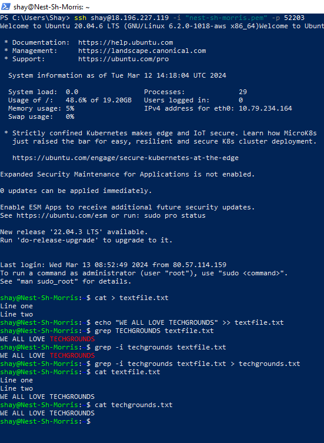

# [Working with text]
Every command in Linux has a standard input and output. The standard input (stdin) is the keyboard, and the standard output (stdout) is the terminal.

## Key-terms
Standard input (stdin): This is referring to the keyboard. With the keyboard you type your input.

Standard output (stdout): This is the terminal. Whatever you write with your keyboard will have an effect on the terminal. 

Command "echo": Writing 'echo hello' will write 'hello' in the terminal

Input & output redirection: Your input and output can be redirected to a file instead of the default.

Pipe: A pipe can be used to have the output of one command be the input of another command.

## Assignment
### Used sources
[Source 1: Using the echo command](https://unix.stackexchange.com/questions/191694/how-to-put-a-newline-special-character-into-a-file-using-the-echo-command-and-re)

[Source 2: Using the echo command](https://runcloud.io/blog/echo-command-in-linux)

### Experienced problems
Reading this assingment confused my brain in the beginning. The solution was to take each new term, and take the time to individually learn about them. Clarity soon followed.

### Results
Tasks:
-   Use the echo command and output redirection to write a new sentence into your text file using the command line. The new sentence should contain the word ‘techgrounds’.
-   Use a command to write the contents of your text file to the terminal. Make use of a command to filter the output so that only the sentence containing ‘techgrounds’ appears.
-   Read your text file with the command used in the second step, once again filtering for the word ‘techgrounds’. This time, redirect the output to a new file called ‘techgrounds.txt’.

