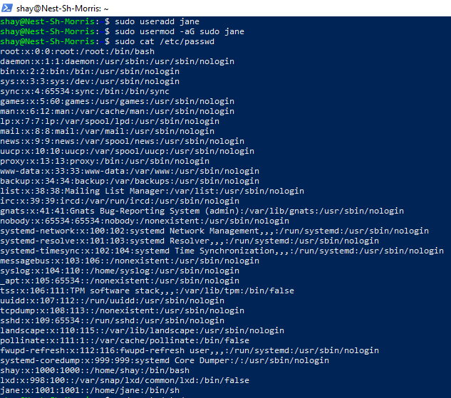
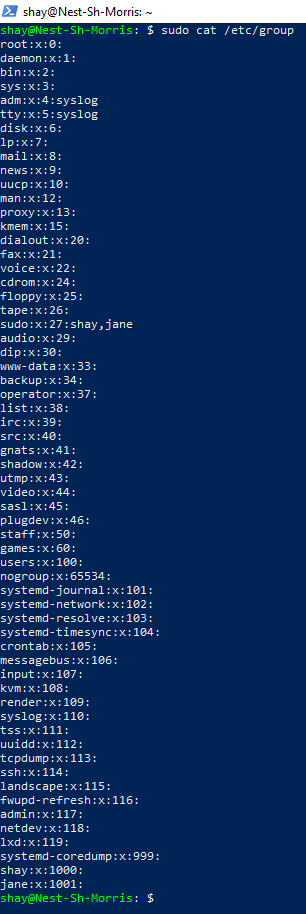

# [Users & Groups]
As with any OS, Linux also has users, each one with their own home directory. It is possible for users to be part of groups. One of the users, the "root" user, is allowed to do anything.

If you want to gain temporary root permissions, you can do so with the "sudo" command. You need to have special permissions to do this. Different actions require specific permissions, like root permissions.

There's different files across the system to store users, passwords, and groups.

## Key-terms
Root: A special user that is allowed to do anything in the OS.

sudo: A command to gain temporary root permissions, if your user account has permissions to use that command.

Regular users: Standard and administrative users created by the administrator.

System users: Users created by the system and applications used to run services.

System administrator: Manages the system's users and groups. Does so by creating and removing users. Also assigns them to different groups.

useradd: Command used to create new users in Linux and Unix systems.\
               Syntax: useradd [OPTIONS] USERNAME

## Assignment
### Used sources
[Source 1: Creating a user](https://linuxize.com/post/how-to-create-users-in-linux-using-the-useradd-command/)

[Source 2: Creating a user](https://www.cyberciti.biz/faq/add-new-user-account-with-admin-access-on-linux/)

[Source 3: Passwords and user location](https://mwiza.medium.com/how-is-user-account-information-stored-in-linux-999e26e7d361#:~:text=The%20%2Fetc%2Fshadow%20file%20stores,your%20system%20has%20a%20password.)

[Source 4: Difference sudo and admin](https://linuxconfig.org/distinguishing-between-the-sudo-and-admin-groups-in-linux-roles-and-usage)

### Experienced problems
I was confused about admin groups. Wondering if they are different from the sudo group. This was solved when I got my head around googling the right question. 

### Results
-   Create a new user in your VM.
    -   The new user should be part of an admin group.
    -   The new user should have a password.
    -   The new user should be able to use ‘sudo’
-   Locate the files that store users, passwords, and groups. Find your newly created user’s data in there.

