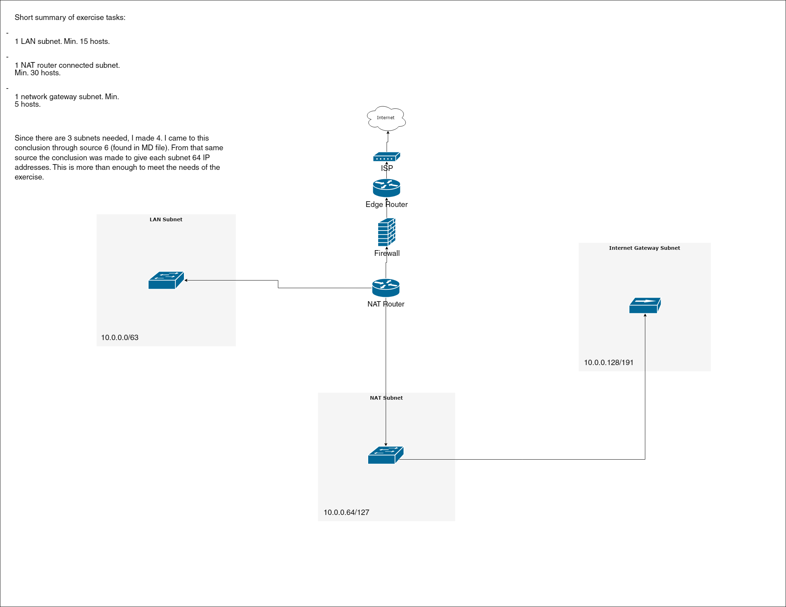

# [Subnetting]
When talking about a network, you're talking about two or more devices that are able to share data through a connection. A Local Area Network (LAN) is often expressed as a range of IP addresses. Within this range, each device (host) gets their own address. Subnet masks (prefix) are used to define how many bits of the address are part of the network address, and how many are reserved for the host. 

Subnets can be used to logically isolate part of a network. They are a small network within a larger one. Per definition, a subnet has a larger prefix than the network it sits in. 

CIDR notation is used to make all this stuff legible for humans.

## Key-terms
Local Area Network: A collection of devices connected together in one place.

Host: A device that is able to permit access to a network.

Subnet mask (IPv4) & prefix (IPv6): The systems used to ascribe private IP addresses to devices on the same network or subnet. 

Subnet: A logically isolated part of a network.

CIDR (Classless Inter-Domain Routing): A method for allocating IP addresses. (CIDR.xyz is a handy tool that visualises the CIDR range of a given IP address)

ACL (Access Control List): A set of rules to determine permission rights for users. 

## Assignment
### Used sources
[Source 1: What is a LAN?](https://www.cisco.com/c/en/us/products/switches/what-is-a-lan-local-area-network.html)

[Source 2: What is a host?](https://csrc.nist.gov/glossary/term/host#:~:text=A%20host%20is%20any%20hardware,%2C%20and%20multi%2Dfunctional%20devices.)

[Source 3: Subnet masks & prefixes](https://www.ibm.com/docs/en/ts3500-tape-library?topic=formats-subnet-masks-ipv4-prefixes-ipv6)

[Source 4: Understanding CIDR](https://www.youtube.com/watch?time_continue=95&v=I_LXaIg6mkM&embeds_referring_euri=https%3A%2F%2Fwww.google.com%2Fsearch%3Fq%3DCIDR%2Bexplained%26oq%3DCIDR%2Bexplained%26gs_lcrp%3DEgZjaHJvbWUyCQgAEEUYORiABDIHCAEQABiABDIICAIQABgWGB4yCAg&source_ve_path=MzY4NDIsMzY4NDIsMTM5MTE3LDEzOTExNywzNjg0MiwzNjg0MiwzNjg0MiwyMzg1MQ&feature=emb_title)

[Source 5: What is an ACL?](https://www.solarwinds.com/resources/it-glossary/access-control-list-acl)

[Source 6: Subnetting video tutorial](https://www.youtube.com/watch?v=ecCuyq-Wprc)

[Source 7: Tool to make the network diagram](https://app.diagrams.net/)

[Source 8: Subnet calculator](https://cidr.xyz/)

[Source 9: Chat GPT as my lord and saviour in trying times](https://chat.openai.com/)

### Experienced problems
This exercise felt like way too much in one go. Learning about the subject went fine, but when I needed to put it into practice by building a network architecture with subnets, I was overwhelmed by all the options to make a network in the diagram app I used. In the end I tried to take it step by step, and used Chat GPT to help fill the gaps. 

### Result
Tasks:

-   Design a network architecture that meets the following demands:
    -   1 subnet that can only be reached from within the LAN. This subnet needs to hold a minimum of 15 hosts.
    -   1 subnet that has internet access through a router with NAT-functionality. This subnet needs to hols a minimum of 30 hosts (this means 30 hosts excluding the router).
    -   1 subnet with a network gateway to the internet. This subnet needs to hold a minimum of 5 hosts (this means 5 hosts excluding the internet gateway).
-   Place the architecture that you've designed, including a short explanation, in your GitHub repository. 

Images:
