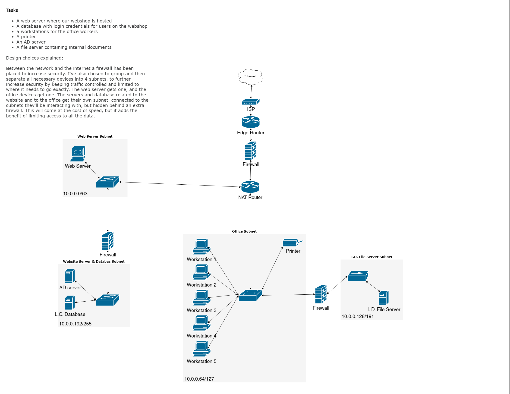

# [Networking Case Study]
In this case study I have to take on the role of a network administrator that sets up a network in the new office of a small e-commerce company. Network security is of the utmost importance to this company.

## Key-terms
Web server: A web server is both hardware and software working together to make a website possible.   
-   The hardware is a computer that stores the software, and all necessary files e.g. HTML documents, images, CSS stylesheets, and JavaScript files. It connects to the internet so that devices also connected to the internet can communicate with the website.     

-   The software is at least an HTTP server. This server understands URL's (web addresses), and HTTP (a web browser viewing protocol)

Database: A database, typically stored on a computer, is an organised collection of structured information, or data. 

AD server: An ad server is a dedicated server for ads. It analyses data of website users to then give the publisher's ad server the most relevant ad for each user.

## Assignment
### Used sources
[Source 1: What is a web server?](https://developer.mozilla.org/en-US/docs/Learn/Common_questions/Web_mechanics/What_is_a_web_server)

[Source 2: What is a database?](https://www.oracle.com/database/what-is-database/)

[Source 3: What is an ad server?](https://www.adjust.com/glossary/ad-server-definition/)

### Experienced problems

### Result
Tasks:

-   Design a network architecture for the above use case.
    -   See image below.
-   Explain your design decisions.
    -   See image below.

Image:

