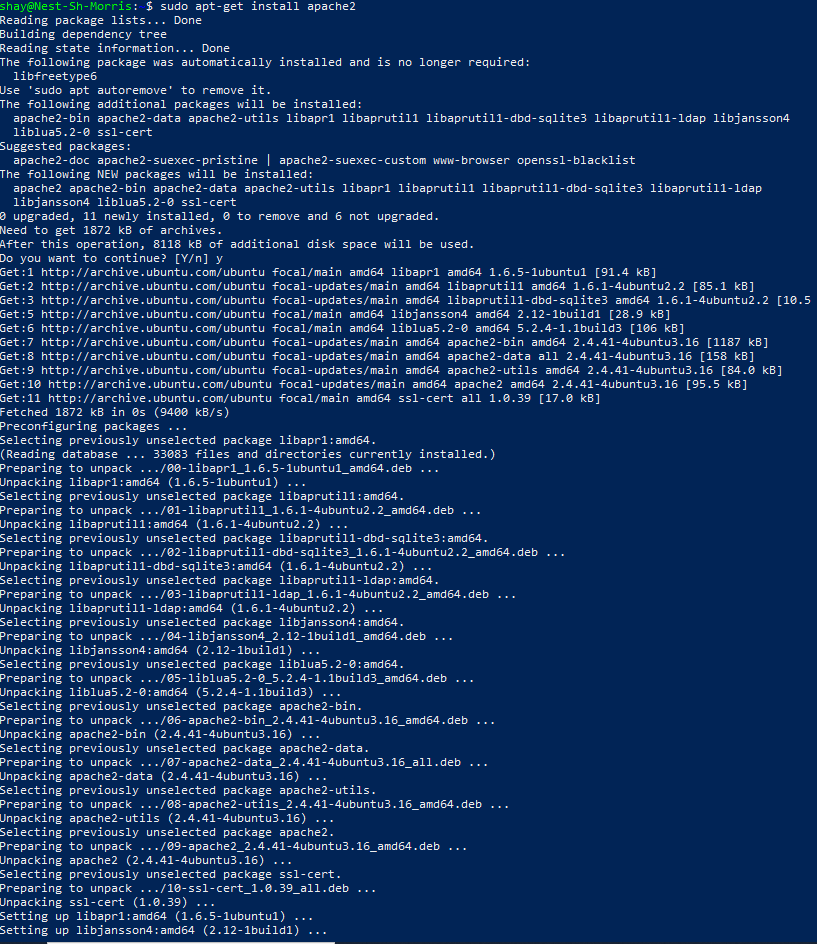
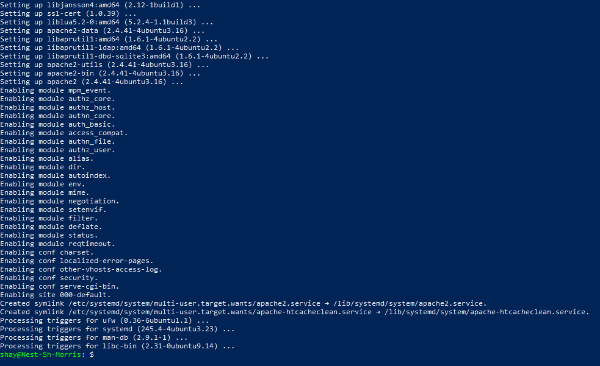
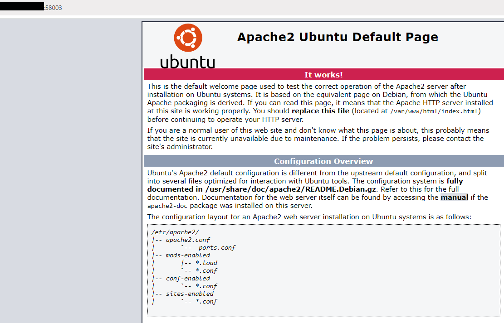
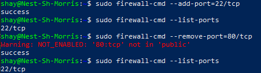
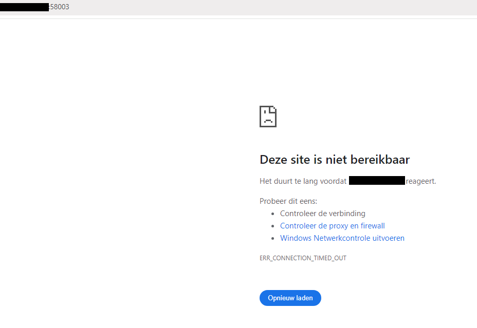

# [Firewalls]
To filter out network traffic, firewalls exist. Firewalls are software that can filter traffic on protocol, port nr., source, and destination of a packet. If you have a more advanced firewall it is able to also inspect the contents of packets to block potential dangers.
CentOS and RHEL have a standard firewall daemon (firewalld) installed. Ubuntu also has a standard firewall installed (ufw). Iptables is an older but still common firewall in Linux.

There are stateful and stateless firewalls. If you have a stateful firewall, it will remember the different states of a trusted active session. This way, a stateful firewall doesn't need to scan each packet that comes through. 

Firewalls will be a common occurrence within cloud environments as one of the many defenses against the public internet.

## Key-terms
Firewall: As a network security device, firewall monitors incoming and outgoing traffic. It then decides, based on a security rule set, whether to allow or block specific traffic.

CentOS (Community Enterprise Operating System): A Linux distribution preferred for web hosting

RHEL (Red Hat Enterprise Linux): A commercial open-source Linux distribution.

Firewall daemon: A daemon, as discussed in the week 1 processes chapter, is a non-interactive computer program, meaning it runs in the background. So a firewall daemon is a non-interactive firewall.

Firewalld: A zone based firewall introduced in RHEL 7.0 as a successor to iptables. 

Ufw (Uncomplicated Firewall): The default firewall configuration tool for Ubuntu. It is developed to ease iptables firewall configuration. It is used to create an IPv4 or IPv6 host-based firewall.

Iptables: An interface to netfilter. Netfilter is a kernel module that decides that packets are allowed to go in and out of the network. So iptables is the frontend, and netfilter the backend. 

Stateless firewall: A stateless firewall evaluates all packets based on the data they contain. This is normally the packet header.
It is fast, scalable, and cost effective. It is also much less secure than other types of firewalls, for instance, the stateful firewall.

Stateful firewall: A stateful firewall keeps track and monitors the state of active network connections. It analyses incoming traffic to look for potential traffic and data risks. it can analyse the data within a packet, instead of only the packet header, and this way it can see if they contain malicious code. It can also detect attempts by unauthorised individuals to access the network.

Firewall hardware: An external firewall set up in a physical device much like a server. It sits between the internet and your network. This way it applies the firewall to all devices on a network and eliminates the need for each device to set up and maintain its own firewall. This minimises risks.

Firewall software: An internal firewall that is set up on each computer to inspect data that comes in and goes out of it. 

## Assignment
### Used sources
[Source 1: What is a firewall?](https://www.cisco.com/c/en/us/products/security/firewalls/what-is-a-firewall.html)

[Source 2: What is CentOS?](https://www.liquidweb.com/kb/what-is-centos/#:~:text=What%20is%20CentOS%20used%20for,OS%20used%20for%20web%20hosting.)

[Source 3: What is RHEL?](https://en.wikipedia.org/wiki/Red_Hat_Enterprise_Linux)

[Source 4: What is firewalld?](https://www.redhat.com/sysadmin/beginners-guide-firewalld)

[Source 5: What is Ufw?](https://help.ubuntu.com/community/UFW)

[Source 6: What is iptables?](https://medium.com/skilluped/what-is-iptables-and-how-to-use-it-781818422e52)

[Source 7: What is a stateless firewall?](https://www.checkpoint.com/cyber-hub/network-security/what-is-firewall/what-is-a-stateless-firewall/#:~:text=A%20stateless%20firewall%20is%20one,the%20data%20that%20it%20contains.)

[Source 8: What is a stateful firewall?](https://www.fortinet.com/resources/cyberglossary/stateful-firewall)

[Source 9: What is firewall hardware & software?](https://www.fortinet.com/resources/cyberglossary/hardware-firewalls-better-than-software)

### Experienced problems
I was unable to view the standard webpage for reasons I don't yet understand. I'll continue tomorrow.       So, tomorrow has come, and I've found out with the help of a classmate that I was simply not using my web port. It was given to us, but we hadn't needed it until now, so it had completely slipped my mind. I was trying to solve something that never needed solving.

### Result
Tasks:
-   Install a webserver on your VM.
    -	This is done with the command : sudo apt-get install apache2. See image 1 & 2.
-   View the standard page that is installed with the webserver. Do this on your browser on your pc/laptop.
    -	This is done by typing in the VM's IP address and web port nr. See image 3 for result. (In favour of proper security etiquette, I blocked out the IP Address. this makes proving I did the task right harder, but I think proper security etiquette trumps that.)
-   Set the firewall to block web traffic, but allow ssh-traffic.
    - See image 4.
-   Control if the firewall does its job.
    - See image 5. The webpage is no longer accessible. 

1. 
  

2. 
  

3. 
  

4. 
  

5. 

