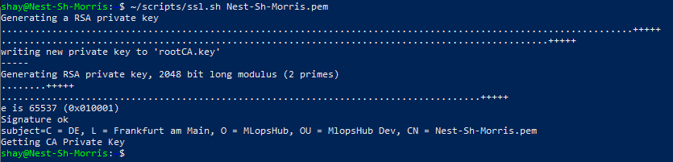
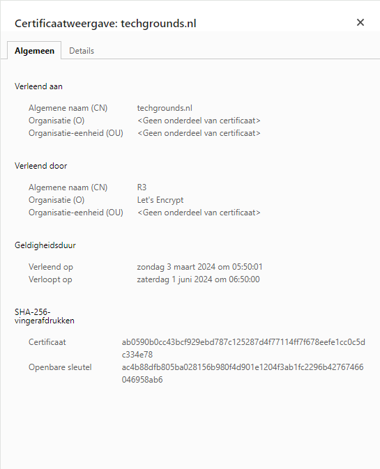
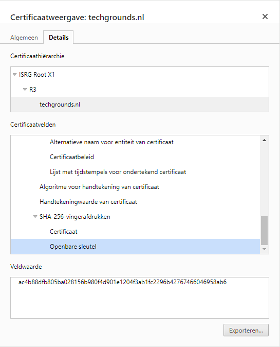
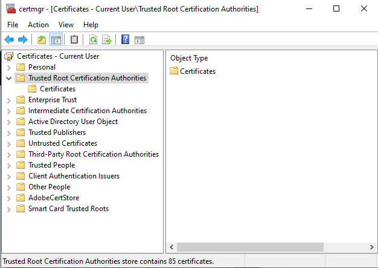
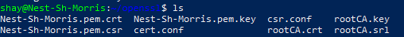

# [Public Key Infrastructure]
When you create, manage, distribute, use, store, and revoke digital certificates, you need Public Key Infrastructure (PKI). This PKI is a set of roles, policies, hardware, software, and procedures.
There are three entities it consists of that make sure you can securely communicate over an insecure network like the public internet.

The standard that defines a process in which a PKI should function is X.509. Of all the ways to implement PKI, not all comply with the X.509 standard. 

## Key-terms
Public Key Infrastructure (PKI): A set of roles, policies, hardware, software, and procedures needed when you create, manage, distribute, use, store, and revoke digigital certificates. 

Self-Signed Certificate: An SSL/TSL certificate signed by the creator's own personal root CA certificate, instead of by a public or private certificate authority.

SSL (Secure Sockets Layer): An encryption-based internet security protocol used to ensure privacy, authentication, and data integrity in Internet communications.

TLS (Transport Layer Security): The successor to SSL. The reason the name was changed is because SSL was developed by Netscape, and TLS by Certicom. Because it is SSL's successor, SSL & TLS are used interchangeably. 

CSR (Certificate Signing Request): An encoded file containing information about someone's website, service, organisation, and domain name, used by a CA (Certificate Authority) to create an SSL/TLS certificate. When this certificate is created, traffic from the aforementioned website can be encrypted. 

CA (Certificate Authority): A company or organisation that validates the identity of entities to then bind them to cryptographic keys by use of digital (TLS/SSL) certificates. Entities such as websites, email addresses, companies, or individual persons.

Root CA: As I understand it, a root CA is a root Certificate Authority certificate. Meaning it is a digital certificate given out by the issuing Certificate Authority. 


## Assignment
### Used sources
[Source 1: How to create a self signed certificate/What is a self signed certificate?](https://devopscube.com/create-self-signed-certificates-openssl/)

[Source 2: What is SSL?](https://www.cloudflare.com/learning/ssl/what-is-ssl/)

[Source 3: What is TLS?](https://www.cloudflare.com/learning/ssl/transport-layer-security-tls/)

[Source 4: What is CSR?](https://www.keyfactor.com/blog/what-is-a-certificate-signing-request-csr/)

[Source 5: What is a CA?](https://www.ssl.com/article/what-is-a-certificate-authority-ca/)

[Source 6: What is Root CA?](https://venafi.com/blog/what-difference-between-root-certificates-and-intermediate-certificates/)

### Experienced problems
I don't think I've done the certificate perfectly. I can find everything I need, so I think it's all fine, but I feel as though things aren't in the right place. This is because Chat GPT sent me towards a specific path where I did not find the trusted certificate roots.

### Result
Tasks:

-	Create a self-signed certificate on your VM.  
    -	For this we will use the following script:

    ```
    #! /bin/bash

    if [ "$#" -ne 1 ]
    then
    echo "Error: No domain name argument provided"
    echo "Usage: Provide a domain name as an argument"
    exit 1
    fi

    DOMAIN=$1

    # Create root CA & Private key

    openssl req -x509 \
                -sha256 -days 356 \
                -nodes \
                -newkey rsa:2048 \
                -subj "/CN=${DOMAIN}/C=DE/L=Frankfurt am Main" \
                -keyout rootCA.key -out rootCA.crt 

    # Generate Private key 

    openssl genrsa -out ${DOMAIN}.key 2048

    # Create csf conf

    cat > csr.conf <<EOF
    [ req ]
    default_bits = 2048
    prompt = no
    default_md = sha256
    req_extensions = req_ext
    distinguished_name = dn

    [ dn ]
    C = DE
    L = Frankfurt am Main
    O = MLopsHub
    OU = MlopsHub Dev
    CN = ${DOMAIN}

    [ req_ext ]
    subjectAltName = @alt_names

    [ alt_names ]
    DNS.1 = ${DOMAIN}
    DNS.2 = www.${DOMAIN}
    IP.1 = 192.168.1.5 
    IP.2 = 192.168.1.6

    EOF

    # create CSR request using private key

    openssl req -new -key ${DOMAIN}.key -out ${DOMAIN}.csr -config csr.conf

    # Create a external config file for the certificate

    cat > cert.conf <<EOF

    authorityKeyIdentifier=keyid,issuer
    basicConstraints=CA:FALSE
    keyUsage = digitalSignature, nonRepudiation, keyEncipherment, dataEncipherment
    subjectAltName = @alt_names

    [alt_names]
    DNS.1 = ${DOMAIN}

    EOF

    # Create SSl with self signed CA

    openssl x509 -req \
        -in ${DOMAIN}.csr \
        -CA rootCA.crt -CAkey rootCA.key \
        -CAcreateserial -out ${DOMAIN}.crt \
        -days 365 \
        -sha256 -extfile cert.conf
    ```

    -	After creating the script, we will run it.  
        -   See image 1  

 
-	Analyze some certification paths of known websites (ex. techgrounds.nl / google.com / ing.nl).  
    -   See image 2 & 3.
-	Find the list of trusted certificate roots on your pc/laptop (bonus points if you also find it in your VM).  
    -   See image 4 (actual certificate roots not shown. I don’t know if that’s delicate information or not, so it’s kept out) & 5. 

Images:    
1.  

2.  
  
3.  
  
4.  
  
5.  
