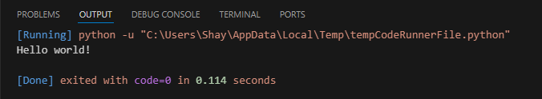

# [Setting Up]
Having some basic programming knowledge is a requirement for a lot of IT jobs. Not much more is required apart from understanding and modifying code snippets to fit your needs. To be able to do this one needs to learn the basic principles of programming.   
Python is often seen as the easiest programming language to learn, because the syntax is very simple. 

## Key-terms
Python: Python is an open source programming language. It is an interpreted, object-oriented, high-level programming language with dynamic semantics.   
It is often used to build websites and sofware, automate tasks, and conduct data analysis.

Path: The PATH is the system variable your OS (Operating System) uses to locate needed executables from either the command line or Terminal window.

## Assignment
### Used sources
[Source 1: How to add Python to Path](https://realpython.com/add-python-to-path/)

[Source 2: What is Python?](https://www.python.org/doc/essays/blurb/)

[Source 3: What is Python used for?](https://www.coursera.org/articles/what-is-python-used-for-a-beginners-guide-to-using-python) 

[Source 4: What is PATH?](https://www.java.com/en/download/help/path.html#:~:text=General%20Information,file%20on%20Linux%20and%20Solaris.)

### Experienced problems


### Result
Tasks:

-	Install the latest version of Python from https://www.python.org/
    -   &#x2611;
-	Install VS Code from https://code.visualstudio.com/download
    -	&#x2611;
-	Install the Python plug-in in VS Code.
    -	&#x2611;
-	Write the following Python code: ```print("Hello world!")```. The output in the terminal should be the text “Hello world!”
    


