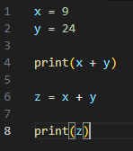
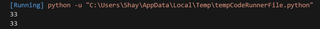
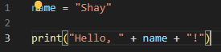
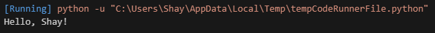
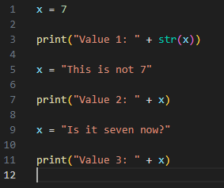
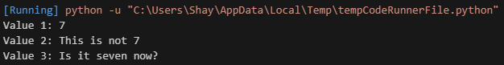

# [Variables]
Variables can store a value. By using the variable name in a code, you can access this value. Mighty handy if you want to repeatedly use one value, or if you want to dynamically change the value.  
Any string of characters van be used to name a variable (some special cases reserved for other use are excepted). Best practice in naming variables is to keep it short and descriptive of the variable context. For instance, a variable that stores user input might be named _input_, or *usr_inpt*.

Useful tip is to remember you can put a print statement anywhere in the code to read the current value of a variable. Very useful when trying to find a bug in a script.

## Key-terms
Variable: A variable is a container used for storing data.

String: A string is a piece of text contained within single, or double quotation marks.

Print Function: The print Function prints the specified message to the output device. This message can be a string or any other object. 

## Assignment
### Used sources
[Source 1: How to concatenate a fixed string and an integer variable](https://stackoverflow.com/questions/18348717/how-to-concatenate-a-fixed-string-and-a-variable-in-python)

[Source 2: What is a variable?](https://www.w3schools.com/python/python_variables.asp)

[Source 3: What is a string?](https://www.w3schools.com/python/python_variables.asp)

[Source 4: What is the print Function?](https://www.w3schools.com/python/ref_func_print.asp#:~:text=The%20print()%20function%20prints,before%20written%20to%20the%20screen.)

### Experienced problems

### Result
Tasks:

-   Exercise 1:  
    -   Create a new script.  
    -   Create two variables x and y. Assign a numerical value to both variables.  
    -   Print the values of x and y.  
    -   Create a third variable named z. The value of z should be the sum of x and y.  
    -   Print the value of z.  
      

-   Exercise 2:
    -   Create a new script.
    -   Create a variable called name. The value of name should be your name.
    -   Print the text “Hello, YOURNAME!”. Use the variable name in the print statement.  
      

-   Exercise 3:
    -   Create a new script.
    -   Create a variable and assign a value to it.
    -   Print the text “Value 1: VALUE1”.
    -   Change the value of that same variable.
    -   Print the text “Value 2: VALUE2”.
    -   Change the value of that same variable.
    -   Print the text “Value 3: VALUE3”.  
      

