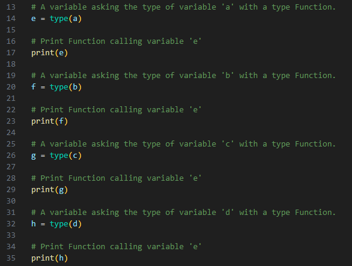
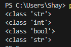
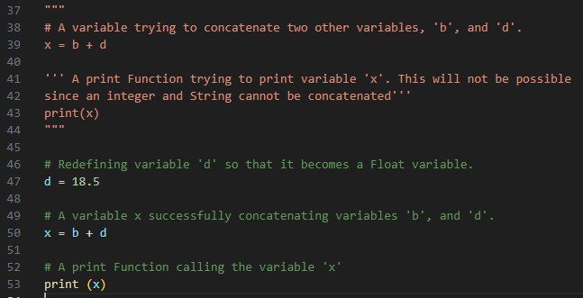
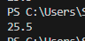
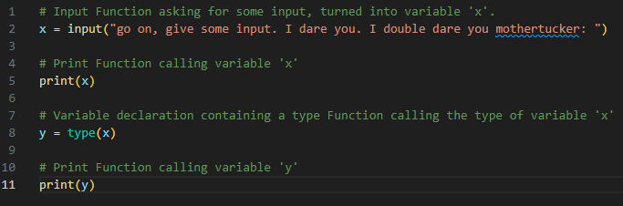
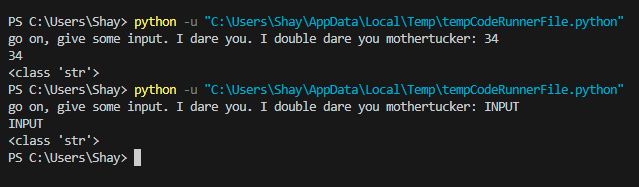

# [Data Types & Comments]
Computers can only see strings of zeros and ones. To tell computers how to interpret those strings, programming languages make use of data types. For example, the computer needs to know the data type of 01000001 to know if it either means 65, or "A." Here is a non-exhaustive list of some of the most important data types in Python:

-   boolean  
    A binary state that is either _True_ or _False_.
-   String  
    Technically an array of characters. Strings are denoted using "" double quotes, or '' single quotes.  
    ```String = "this is a String"```
-   Int  
    An integer is a whole number. Ints can be both positive and negative.  
    ```integer = 6```
-   Float  
    A floating-point number is a decimal number.  
    ```floating_point = 18.5```

Comments are lines that do not get processed as code. There's a couple reasons you'd use comments e.g., writing out a short description of what a block of code does, 'commenting out' some code, so that it is temporarily removed. The latter can be useful for testing and debugging.

## Key-terms
Data type: Data types are used to tell computers how to interpret strings of zeros and ones.

Comments: Lines that do not get processed as code.

Input Function: A Function used to get input from a user.

Type Function: A Function used to get the type from a variable.

## Assignment
### Used sources
[Source 1: How to take input in VSCode Python IDE](https://stackoverflow.com/questions/71030502/visual-studio-code-is-not-taking-input-from-keyboard-when-i-use-c-or-java#:~:text=Your%20program%20is%20running%20in,in%20Visual%20Studio%20Code%20Settings.&text=Note%3A%20It%20is%20supposed%20that%20you%20have%20Code%20Runner%20extension%20installed.)

[Source 2: What is an input Function?](https://www.w3schools.com/python/ref_func_input.asp)

[Source 3: What is a type Function?](https://w3schools.com/python/ref_func_type.asp)

### Experienced problems
I wasn't able to enter any input into the terminal. This was because the program was running in the output tab. I turned on the terminal tab and solved the issue.  
I had misread how to take input with the input Function, and looked past how the example was using a print Function, and afterwards an input Function. I added the text to be printed within the input Function and added an extra input Function below. This was giving me confusing results. 


### Result
Exercise 1:
-	Create a new script.  
    &#x2611;
-	Copy the code below into your script.  
    a = 'int'  
    b = 7  
    c = False  
    d = "18.5"  
    &#x2611;
-	Determine the data types of all four variables ( a, b, c, d) using a built-in function.
     
-	Make a new variable x and give it the value b + d. Print the value of x. This will raise an error. Fix it so that print(x) prints a float.  
 
-	Write a comment above every line of code that tells the reader what is going on in your script.    
&#x2611;

 Exercise 2:
-	Create a new script.  
    &#x2611;
-	Use the input() function to get input from the user. Store that input in a variable.  
    
-	Find out what data type the output of input() is. See if it is different for different kinds of input (numbers, words, etc.).  
    

