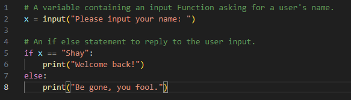
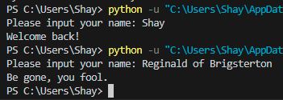
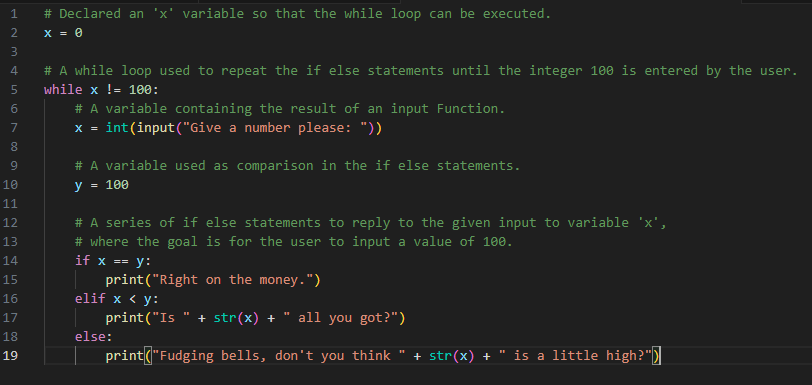
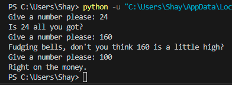

# [Conditions]
Very often, running a piece of code is wanted only when certain conditions are met. For example, wanting to write something to an error log only if the received reply from a server contains an error. Python uses the _if_, _elif_, and _else_ statements for this. 

## Key-terms
If statement: The _if_ statement is used to test a certain condition, and have a certain block of code run if it results to True. One _if_ statement can be used in a series of _if_, _elif_, and _else_ statements.

Elif statement: The _elif_ statement is used after an if statement. It offers another condition to test, if the _if_ statement results to False, and another block of code to run if the _elif_ condition results to True. Multiple _elif_ statements can be used in a series of _if_, _elif_, and _else_ statements.

Else statement: The _else_ statement is used as a final statement that will run a block of code if all previous statements result to False. One _else_ statement can be used in a series of _if_, _elif_, and _else_ statements. There doesn't need to be an _elif_ statement before it, but there must always be an _if_ statement before it.

While loop: A _while_ loop is used to execute a set of statements as long as the condition is true.

## Assignment
### Used sources
[Source 1: What are the if, elif, and else statements?](https://www.w3schools.com/python/python_conditions.asp)

[Source 2: What is a while loop?](https://www.w3schools.com/python/python_while_loops.asp)

[Source 3: Why am I getting a "TypeError: '<' not supported between instances of 'str' and 'int'" error?](https://stackoverflow.com/questions/41950021/typeerror-not-supported-between-instances-of-str-and-int)

### Experienced problems
I was getting "TypeError: '<' not supported between instances of 'str' and 'int'". I looked up why, and got the advice to define the input Function as an int, like so: ```x = int(input("Give a number please: "))```  

It took some experimenting to figure out where the while loop needed to be placed. I still remembered from previous coding that a variable needs to be defined before the while loop, since it is being referenced within the while loop.

### Result
Tasks:

Exercise 1:
-	Create a new script.  
    &#x2611;
-	Use the input() function to ask the user of your script for their name. If the name they input is your name, print a personalized welcome message. If not, print a different personalized message.  
      


 Exercise 2:
-	Create a new script.  
    &#x2611;
-	Ask the user of your script for a number. Give them a response based on whether the number is higher than, lower than, or equal to 100.  
      
-	Make the game repeat until the user inputs 100.  
    &#x2611;
