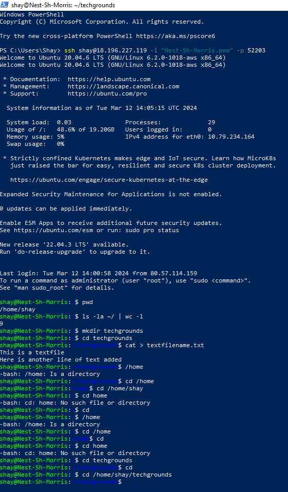
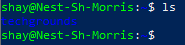

# [Files & Directories]
Linux uses files and directories. Folders are called directories in Linux.

## Key-terms
Slash (/): The slash represents the root directory.

Tilde (~): The tilde is used as an alias for your home directory.

Absolute path: An absolute path always points to the same place. It is a complete path to a file or directory. A complete path means that you start from the roor directory - which is defined by the slash(/)

Relative path: A relative path doesn't always point to the same place. No slash(/) is needed. You start with the map where your file is located, and add the filename e.g. documents/example.txt. Whatever directory you are in at the time of entering the relative path will decide which file you'll end up in.

## Assignment
### Used sources
[Source 1: Linux manual](https://linux.die.net/man/1/intro)

[Source 2: List files command](https://unix.stackexchange.com/questions/261974/list-files-in-your-home-directory)

[Source 3: Creating a file](https://www.wikihow.com/Create-a-File-in-a-Directory-in-Linux)

[Source 4: Creating a text file and populating it right away](https://www.hostinger.com/tutorials/linux-cat-command-tutorial-and-examples/#:~:text=Using%20the%20cat%20command%20you,the%20text%20in%20the%20file.&text=The%20file%20is%20created%2C%20and,begin%20populating%20it%20with%20text.)

### Experienced problems
While I started this assignment I didn't understand which commands needed to be used. This was solved by looking it up online. The sources are noted above.

### Resuls
Tasks: 
-   Find out your current working directory.
-   Make a listing of all files and directories in your home directory.
-   Within your home directory, create a new directory named ‘techgrounds’.
-   Within the techgrounds directory, create a file containing some text.
-   Move around your directory tree using both absolute and relative paths.

listing of files and directories added since I fudged that up:

