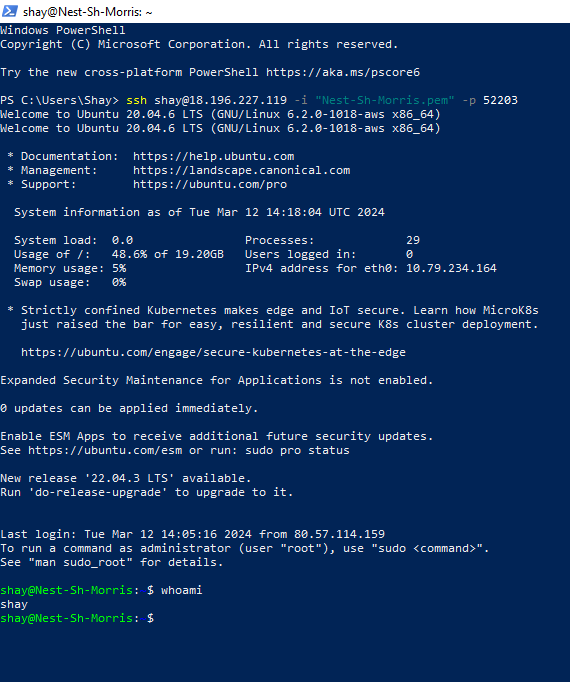

# [Setting up]
the assignment is to connect with a Linux VM machine on AWS.

## Key-terms
GUI (Graphical User Interface): Graphical images, widgets, and text are used to make up a graphical user interface. It's a way of interacting with the computer, also called the frontend.

CLI (Command Line Interface): This is a textual user interface. Through the use of commands you can interact with the computer.

VM (Virtual Machine): This is a virtual OS (Operating System) that runs within another OS.

SSH (Secure Shell): SSH is a cyrptographic network protocol to safely control networks over an unsecure network. 

## Assigment
### Used sources
[Source 1: Unprotected private key warning](https://stackoverflow.com/questions/25869207/getting-warning-unprotected-private-key-file-error-message-while-attempting)

[Source 2: Permission denied 1](https://repost.aws/knowledge-center/ec2-linux-fix-permission-denied-errors)

[Source 3: Permission denied 2](https://docs.github.com/en/authentication/troubleshooting-ssh/error-permission-denied-publickey)

### Experienced problems
I got an "unprotected private key" warning. I was able to solve this through the first source.

After that I got a "permission denied (public key)" error. I looked up some websites (can't find back all sources I looked up), and finally I was able to solve it through the sources, and help of the coach and classmate. 

### Results
Taken:

-   Make an SSH-connection to your virtual machine. SSH requires the key file to have specific permissions, so you might need to change those.
-   When the connection is successful, type whoami in the terminal. This command should show your username.

